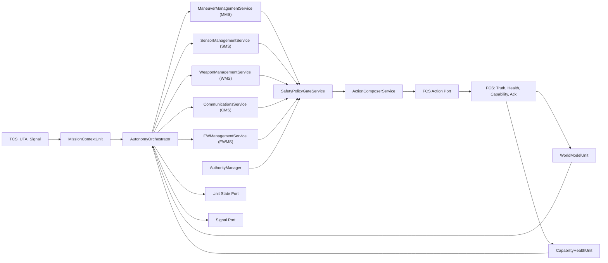

# ELU 功能单元和 API 定义

> **文档版本**：v2.3  
> **修订日期**：2026-06-14  
> **v2.1 修订范围**：合并固定翼物理约束（能量包线、LAR、发射瞬态门控）、分布式空战协同（A 射 B 导、无源交叉定位、战术信道 QoS）、ABMS 自适应 LOA 降级与控制权硬抢占规范。  
> **v2.2 修订范围**：面向未来空战威胁环境（高超声速时间压缩、认知电子战欺骗、蜂群饱和攻击、PNT 深度拒止、数据链网络战、定向能威胁），新增时间预算体系、航迹完整性裁决、批量武器-目标分配、编队相对基准、僚机零信任评估、反射弧分层与预授权交战包络（V3 API 族）。  
> **v2.3 修订范围**：新增 §7.0 A-GRA API 概览列表，提供全量 API 索引、服务域分组、版本代际与产出类型速查。
> **SSOT 红线**：本文自身不发明 wire 字段；跨 ELU↔FCS 边界扩展已按治理流程落入 `ELU_FCS_交互契约_标准文档.md` v2.2（导航健康 `FcsHealth.nav`、反射弧 `arm_reflex_profile`/`FcsHealth.reflex`、弹药成本档 `cost_class`、预授权拒绝码、消息认证 `auth_tag`）；`ELU_TCS` 扩展点见 §4.5 契约演进预留。

## 0. 架构总览与设计理念

本节从抽象层面概括 ELU 的总体架构、功能组成与设计逻辑，作为后文各章（原则、功能单元、A-GRA API、契约映射、闭环与验收）的导读。细节条款以 §2–§13 为准。

### 0.1 总体定位：ABMS 单机自主的"决策中台"

ELU 在 ABMS 体系中处于 **TCS（协同面）** 与 **FCS（执行面）** 之间的决策中台：

- **对上**：消费 TCS 下发的任务委派（UTA）、协同信号（`tcn.signal`）与编队语义，将 Mission → Task → Action 的战术意图收敛为本机可执行的候选动作序列。
- **对下**：严格遵守 FCS 契约，所有物理作动、辐射、开火、改制导均经 `ActionEnvelopeV2` 单一出口，并以 `ActuationAck` 与物理真值闭环。
- **对内**：以硬件无关的 A-GRA 能力服务封装机动、传感、火力、通信、电战等域能力，由统一门控与动作合成器保证安全、可审计、可替换。

ELU **不是**新的跨边界协议，而是既有 `ELU_FCS` / `ELU_TCS` 契约在单机侧的**内部落地分解**；任何跨进程可见字段必须先入权威契约，本文仅定义内部 API 边界与瞬时 DTO 语义。

### 0.2 总体架构：七层闭环 + 双端口语义

ELU 采用"输入 → 事实 → 决策 → 能力 → 仲裁 → 输出"的七层结构，并在每个决策 tick 内完成 **感-知-策-门-行-确** 闭环：

```text
┌─────────────────────────────────────────────────────────────────────────┐
│                         外部权威契约（SSOT）                              │
│   TCS: UTA / tcn.signal / unit.state    FCS: Truth / Health / Capability │
└───────────────┬─────────────────────────────────────┬───────────────────┘
                │ TcsInputPort                        │ FcsInputPort
                ▼                                     ▼
┌─────────────────────────── 输入层 ───────────────────────────────────────┐
│  契约消息接入 + 适配器验签（auth_tag）+ 只读视图派生（禁止反写真值）        │
└───────────────┬──────────────────────────────────────────────────────────┘
                ▼
┌─────────────────────────── 事实层 ───────────────────────────────────────┐
│  MissionContextUnit   WorldModelUnit   CapabilityHealthUnit              │
│  （任务/LOA/ROE）     （态势/完整性）   （能力/健康/导航/反射弧视图）      │
└───────────────┬──────────────────────────────────────────────────────────┘
                ▼
┌─────────────────────────── 决策层 ───────────────────────────────────────┐
│  AutonomyOrchestrator + PlatformSurvivabilityService（PSS）               │
│  按 tick 编排能力调用；威胁评估推导 time_budget_ms（瞬时，不持久化）        │
└───────────────┬──────────────────────────────────────────────────────────┘
                ▼
┌─────────────────────────── 能力层（A-GRA 服务）──────────────────────────┐
│  MMS（机动/能量）  SMS（传感/无源/完整性/相对基准）                        │
│  WMS（火力/LAR/移交/批量分配）  CMS（信号/QoS/零信任）  EWMS（干扰/反射弧） │
│  → 输出 CandidateAction[]（候选动作，非物理指令）                          │
└───────────────┬──────────────────────────────────────────────────────────┘
                ▼
┌─────────────────────────── 仲裁层 ───────────────────────────────────────┐
│  AuthorityManager（四控制面权属 + Force Preempt 挂起）                     │
│  SafetyPolicyGateService（LOA/ROE/EMCON/IFF/包线/LAR/经济性/预授权令牌）    │
│  → 输出 GateDecision + 允许动作列表                                       │
└───────────────┬──────────────────────────────────────────────────────────┘
                ▼
┌─────────────────────────── 输出层 ───────────────────────────────────────┐
│  ActionComposerService → ActionEnvelopeV2（唯一物理出口）                  │
│  UnitStatePort / SignalPort → unit.state / tcn.signal（协同面回报）        │
│  FcsAdapterPort → FCS；等待 ActuationAck 完成"行-确"闭环                   │
└─────────────────────────────────────────────────────────────────────────┘

旁路（瞬时物理评估，不沉淀持久状态）：
  LAR 解算 · 能量包线评估 · 无源交叉定位 · 航迹完整性裁决 · 僚机信任评分
```

**双端口语义**：


| 端        | 契约        | ELU 职责              | 禁止事项                          |
| -------- | --------- | ------------------- | ----------------------------- |
| 协同端（TCS） | 任务、信号、状态  | 解析意图、发布协同、上报降级/对账事件 | 本地签发预授权令牌、单方面隔离编队成员           |
| 执行端（FCS） | 动作、真值、Ack | 合成动作、消费真值、等待回执      | 绕过 FCS 直驱作动器、在 tick 内仿冒毫秒级反射弧 |


### 0.3 功能组成：三类构件

ELU 内部由三类构件组成，**不按硬件驱动划分，而按决策闭环职责划分**：

**（1）核心功能单元（Core Units）** — 维持决策所需的只读上下文与仲裁能力


| 单元                     | 职责摘要                                                               |
| ---------------------- | ------------------------------------------------------------------ |
| `MissionContextUnit`   | 解析 UTA，维护 LOA、ROE、ACM、断链 fallback 等任务上下文视图                         |
| `WorldModelUnit`       | 融合本机与协同态势；航迹完整性裁决；零信任降权；PNT 拒止下消费相对基准                              |
| `CapabilityHealthUnit` | 从 `PlatformCapability` / `FcsHealth` 派生能力与健康只读视图（含 `nav`、`reflex`） |
| `AuthorityManager`     | 四控制面（飞行/火力/传感/EW）权属仲裁；Force Preempt 挂起态                            |
| `SafetyPolicyGate`     | 统一安全门控规则链；映射本地拒绝码至 `ActuationRejectReason`                         |


**（2）A-GRA 能力服务（Capability Services）** — 硬件无关的战术能力 API

按 FACE/A-GRA 规范细化为 MMS、SMS、WMS、CMS、EWMS、PSS、SPGS、ACS 八个服务域，共 V1/V2/V3 三代 API。所有服务遵循同一调用范式：

```text
api_method(request: XxxRequest) -> XxxResult
  输入：ApiContext（只读）+ intent + constraints + trace
  输出：candidate_actions[] + signals[] + state_events[] + rejections[]
```

能力服务只产出**候选动作**与协同副作用，不直接触碰物理总线。

**（3）端口与适配器（Ports & Adapters）** — 契约边界的唯一出入口


| 端口                             | 方向  | 承载契约                                         |
| ------------------------------ | --- | -------------------------------------------- |
| `TcsInputPort`                 | 入   | UTA、`tcn.signal`                             |
| `FcsInputPort`                 | 入   | Truth、Ack、Health、Capability、ControlAuthority |
| `FcsActionPort`                | 出   | `ActionEnvelopeV2`                           |
| `UnitStatePort` / `SignalPort` | 出   | `unit.state`、`tcn.signal`                    |
| `FcsAdapterPort`               | 双向  | 上述 FCS 面的协议翻译（AFSIM / ArkSim / 实装飞控可热替换）     |


适配器只做字节对齐与验签，**不得**承载战术假设或持久影子状态。

### 0.4 设计思想

ELU 架构建立在五条相互支撑的设计思想之上：

**（1）契约先行、SSOT 唯一**

每个业务事实有且仅有一个权威来源：物理真值归 FCS，任务意图归 TCS，动作出口归 `ActionEnvelopeV2`。ELU 内部只允许建立**只读派生视图**与**瞬时 DTO**，禁止发明平行持久字段、镜像缓存或第二写入入口。这一思想直接决定了 §4 数据定义审计的全部结论。

**（2）硬件无关、端口隔离**

决策核与 A-GRA 能力 API 不感知 AFSIM、实装飞控或厂商总线差异；平台差异全部收敛在 `FcsAdapterPort` 与 `PlatformCapability` 声明中。同一决策核注入不同适配器时，`ActionEnvelopeV2` 输出应字节级一致——这是仿真到实装零改核的验收基线。

**（3）安全先行、候选而非指令**

"能想到"不等于"能执行"。所有能力 API 输出的是 `CandidateAction`，必须经过 **权属检查 → 安全门控 → 动作合成 → FCS Ack** 四段流水线才可到达物理层。IFF、控制权、`weapon_status` 等红线检查在任何时间预算档位下均不可跳过。

**（4）物理诚实、平台感知**

固定翼不是无约束质点：能量机动性、飞行包线、LAR 耦合与发射瞬态气动准则构成火力与机动决策的物理底座。这些量从 FCS 真值**实时推导**，每次开火前重新裁决，不以历史缓存替代。

**（5）分布式协同、零信任输入**

ELU 在编队语义下运行，而非孤立单机：A 射 B 导、无源协同定位、战术信道 QoS 与编队相对基准支撑 EMCON 静默与 PNT 拒止下的持续交战。同时，认知电子战与数据链网络战要求对输入持零信任态度——`confidence`（测得准不准）与 `integrity_verdict`（是不是真的）分立裁决，信任分按 tick 瞬时计算、禁止沉淀黑名单。

### 0.5 设计逻辑：关键设计决策及其因果链

以下设计决策不是孤立技巧，而是上述设计思想在工程上的必然推论：

**决策 1：为什么能力 API 与功能单元分离？**

- 功能单元（Units）负责**维持上下文与仲裁**（读多写无、跨 tick 只读视图）。
- 能力服务（Services）负责**产生战术候选**（无状态、可组合、可单测）。
- 分离使 MMS 替换气动模型、SMS 替换定位算法时，不影响权属与安全门控逻辑。

**决策 2：为什么候选动作必须经 SPGS 而非直达 FCS？**

- FCS 侧拒绝码（`ActuationRejectReason`）是纵深防御的**最后一道闸门**，不应承担战术规则链的全部复杂度。
- ELU 本地门控可审计、可回溯（`GateDecision` + `evidence_refs`），并在 FCS 拒绝之前拦截明显违例，减少无效总线流量与重复开火风险。

**决策 3：为什么瞬时 DTO 不持久化？**

- LAR 结果、能量评估、完整性裁决、信任评分均随 tick 输入变化；持久化将制造"旧 A 写出新 B"的幽灵状态，违反 SSOT 红线。
- 需要跨 tick 携带的事实，必须回溯到权威契约字段（如 `PlatformState`、`ActuationAck`）或经 `unit.state.events` 一次性上报。

**决策 4：为什么控制权与安全性分治？**

- `AuthorityManager` 回答"谁有权"（四控制面权属、Force Preempt 挂起）。
- `SafetyPolicyGate` 回答"做了是否合法"（LOA、ROE、EMCON、IFF、包线、LAR、经济性、预授权令牌）。
- 合并将导致抢占挂起与 ROE 违规的语义纠缠，且无法独立单测。

**决策 5：为什么反射弧切分给 FCS 域？**

- 定向能/近距导弹威胁的决策-执行窗口在毫秒级，ELU 软件 tick 环路物理上来不及参与。
- ELU 的职责是**策略武装**（`arm_reflex_profile`），FCS 的职责是**硬件触发与执行**；事后经 `FcsHealth.reflex` 回报，ELU 更新上下文但不预扣诱饵库存。
- 这一切分同时满足安全（反射不含硬杀伤）与 SSOT（库存仍以 `PlatformCapability` 为准）。

**决策 6：为什么预授权交战令牌由 TCS 签发、ELU 只校验？**

- 断链终端交战的 ROE 语义属于编队级战术授权，单机不得自行扩大交战包络。
- 四重包络（目标类别、空间、时间窗、弹药配额）在 ELU 侧逐项硬校验，FCS 侧做存在性/有效期二次校验，形成签发方（TCS）→ 校验方（ELU）→ 执行方（FCS）的三方分权。

### 0.6 与后文章节的映射


| 本文抽象概念            | 后文展开位置                          |
| ----------------- | ------------------------------- |
| 五条设计思想            | §2 架构原则（2.1–2.6）                |
| 七层结构与 Mermaid 数据流 | §3 总体结构                         |
| SSOT 与瞬时 DTO 红线   | §4 数据定义变更审计                     |
| RORO 调用范式与通用对象    | §5 通用 API 约定                    |
| 核心功能单元职责与 API     | §6 核心功能单元                       |
| A-GRA 能力服务字段级定义   | §7 能力 API 细化定义（含 §7.0 API 概览列表） |
| 内外部契约对应关系         | §8 API 与契约映射                    |
| 端到端闭环场景           | §9 典型闭环                         |
| 工程目录与验收标准         | §10–§11                         |


---

## 1. 定位

本文定义 **单机自主执行单元（Execution Logic Unit, ELU）** 的内部功能单元与 API 边界，用于支撑 ABMS 场景下的单机任务自主、分层控制权、人机协同、断链自愈与高安全等级执行。

本文不是替代既有契约的新协议，而是对以下权威契约的内部落地分解：

- `交互契约_ELU_FCS/ELU_FCS_交互契约_标准文档.md`：ELU 与 FCS 的执行面、真值面、Ack 面、控制权面、健康面、能力面。
- `交互契约_ELU_TCS/ELU_TCS_交互契约_标准文档.md`：TCS 与 ELU 的任务委派、协同信号、单机逻辑状态与断链自愈策略。

ELU 内部 API 的基本目标：

- 把 TCS 的任务意图、LOA、ROE/ACM/EMCON 约束转化为可执行的、可审计的动作候选。
- 把 FCS 的物理真值、健康状态和能力边界转化为本地决策可查询的只读视图。
- 把传感器、机动、通信、武器、电战等能力封装为内部能力端口。
- 由统一的安全门控和控制权仲裁决定动作能否进入 `ActionEnvelopeV2`。
- 保持 FCS 适配器可替换，使 AFSIM/ArkSim 与真实飞控共享同一 ELU 决策核。
- **面向固定翼飞机**：所有机动与火力 API 必须感知能量机动性、飞行包线与发射可达区（LAR）耦合，禁止将平台简化为无约束质点。
- **面向分布式空战**：支持跨平台中导移交、无源协同定位、动态 EMCON 与高频战术信道优先级，满足 ABMS 多节点协同交战语义。
- **面向未来威胁环境**：决策环路具备时间预算意识（高超声速压缩杀伤链）、输入信任意识（认知电子战欺骗与数据链网络战）、资源经济意识（蜂群饱和消耗战），并通过预授权交战包络与反射弧分层覆盖断链终端交战与毫秒级定向能自卫两个极端时间尺度。

## 2. 架构原则

### 2.1 SSOT 原则

- 物理真值 SSOT：`PlatformState`、`WeaponState` 来自 FCS。
- 平台能力 SSOT：`PlatformCapability` 来自 FCS。
- 平台健康 SSOT：`FcsHealth` 来自 FCS。
- 协同任务 SSOT：`UnitTaskAssignment` 来自 TCS。
- 协同事件 SSOT：`tcn.signal` 与 `unit.state` 按 `ELU_TCS` 契约发布和消费。
- 动作出口 SSOT：所有物理动作必须经 `ActionEnvelopeV2` 发往 FCS。

ELU 内部允许建立只读派生视图，但不得把派生视图反写成物理真值，也不得在功能单元内发明与上述契约并行的持久字段。

### 2.2 端口与适配器原则

ELU 决策核只依赖抽象端口：

- `TcsInputPort`：接收 UTA、Signal、外部协同事件。
- `FcsInputPort`：接收 Truth、Ack、Health、Capability、ControlAuthorityState。
- `FcsActionPort`：发送 `ActionEnvelopeV2`。
- `UnitStatePort`：发布 `UnitTacticalState`。
- `SignalPort`：发布和订阅 `tcn.signal`。

任何真实飞控 SDK、AFSIM、ArkSim、厂商数据总线、硬件驱动细节都只能出现在适配器内，不能进入 ELU 决策核和能力 API。

### 2.3 安全先行原则

所有 A-GRA 规范服务输出的是 **候选动作**，不是直接物理指令。候选动作必须经过：

1. `AuthorityManager`：检查飞行、火力、传感器、EW 四个控制面是否由 ELU 持有。
2. `SafetyPolicyGateService`：检查 LOA、ROE、ACM、EMCON、IFF、平台包线、武器库存、健康状态和消息时效性。
3. `ActionComposerService`：合成 `ActionEnvelopeV2`，为离散动作生成稳定 `command_id`。
4. `FcsAdapterPort`：发送到 FCS，并等待 `ActuationAck` 闭环。

### 2.4 固定翼物理约束原则

固定翼平台与旋翼/地面无人系统不同，ELU 决策必须遵守以下物理边界：

- **能量机动性（Energy Maneuverability）**：机动规划前必须评估特定过剩功率 $P_s$、失速裕度与最小转弯半径，防止规避动作导致持续掉速或失速。
- **飞行包线（Flight Envelope）**：高度、空速、过载（G-Load）、攻角（$\alpha$）、侧滑角（$\beta$）必须在 `PlatformCapability` 与 `PlatformState` 联合约束内；超包线候选动作由 `SafetyPolicyGateService` 硬拒绝。
- **发射可达区（LAR / WRA）**：武器释放不是静态距离判断，而是载机马赫数、高度、发射过载、目标态势的耦合函数；开火前必须调用 LAR 解算接口。
- **发射瞬态气动准则**：大过载拉起、负过载推杆、大侧滑状态下禁止离架，防止弹药分离故障或吸入尾气。

上述物理量均从 FCS 真值实时推导，**不得**在 ELU 内持久缓存为第二事实源。

### 2.5 分布式空战协同原则

ABMS 分布式空战要求 ELU 在编队语义下运行，而非孤立单机：

- **A 射 B 导（Launch-and-Leave / Guidance Handover）**：发射平台可在点火后执行 Crank/F-pole 规避，将中导照射权移交给位置更优的僚机；移交通过 `tcn.signal` + WMS 制导移交 API 闭环。
- **无源协同定位（Passive Co-perception）**：EMCON 静默下，多机 IRST/ESM 测向数据经时空对齐后交叉定位，产出带协方差的三维 track，不升级为物理真值。
- **动态 EMCON**：除静态 `current_emcon_level` 外，允许基于威胁态势申请短瞬态 LPI 射频突破（RF Burst），须经 SPGS 审批。
- **战术信道 QoS**：中导交联包、被动测向快照优先于普通态势广播，由 `CommunicationsService` 高频战术信道承载。

### 2.6 未来威胁环境适应原则

未来空战威胁的本质是**时间被压缩、输入被毒化、资源被消耗**。ELU 必须在以下三个维度建立系统性防御：

- **时间预算体系（Time Budget Discipline）**：
  - 每个决策 tick 由威胁评估实时推导 `time_budget_ms`（瞬时值，不持久化）。
  - 预算充足时执行完整串行门控；预算临界时允许校验并行化（LAR 与 IFF 并发），但 **IFF 与控制权检查在任何时间档位下不得跳过**。
  - 断链终端交战仅允许通过 TCS 预先签发的**预授权交战包络**（带目标类别、空间包络、时间窗、弹药配额四重约束的令牌）完成自卫，令牌过期立即回到 fail-safe。
- **输入信任体系（Zero-Trust Input）**：
  - 任何参与开火解算的 track 必须先通过**航迹完整性裁决**（运动学合理性、多源一致性、时空连续性三重校验），`confidence` 表达"测得准不准"，`integrity_verdict` 表达"是不是真的"，二者不可互替。
  - 跨机消息在适配器层验签（`auth_tag`），决策核只消费验签结果；协同源按 tick 做瞬时信任评分，低信任源数据在融合中自动降权。**禁止**将信任分沉淀为持久黑名单（防幽灵状态），隔离裁决权上收 TCS。
- **资源经济与反射分层（Economy & Reflex Layering）**：
  - 蜂群饱和下按威胁簇做批量武器-目标分配，弹药经济性门控（`cost_class` 交换比规则）防止高值弹药被假目标和低值目标骗光。
  - 毫秒级自卫反射（光学快门、自动箔条、孔径保护）属于 **FCS 域硬件反射弧**，ELU 不在软件 tick 环路内仿冒；ELU 的职责是通过 `arm_reflex_profile` 预先武装策略，事后经 `FcsHealth.reflex` 与 Ack 获知结果并更新上下文。

## 3. 总体结构




### 3.1 分层

- 输入层：`TcsInputPort`、`FcsInputPort`。
- 事实层：`WorldModelUnit`、`CapabilityHealthUnit`、`MissionContextUnit`。
- 决策层：`AutonomyOrchestrator`、`PlatformSurvivabilityService (PSS)`。
- 能力层：A-GRA 规范定义能力服务 (MMS, SMS, WMS, CMS, EWMS)。
- 仲裁层：`AuthorityManager`、`SafetyPolicyGateService`。
- 输出层：`ActionComposerService`、`FcsActionPort`、`UnitStatePort`、`SignalPort`。
- **物理评估层（瞬时）**：LAR 解算、能量状态评估、无源交叉定位均在 tick 内由能力 API 实时计算，结果不沉淀为持久状态。

## 4. 数据定义变更审计

### 4.1 是否新增契约字段

本文不直接新增 `ELU_FCS` 或 `ELU_TCS` wire contract 字段。所有 API 输入、输出、结果对象均为 ELU 内部瞬时 DTO，用于描述调用边界，不作为持久状态、总线消息或第二事实源。

### 4.2 现有唯一事实来源

- 平台位置、速度、燃油、姿态：`PlatformState`。
- 武器在飞、挂载、目标绑定：`WeaponState` 与 `PlatformCapability.weapon_stores[]`。
- 传感器可用性、EMCON、IFF、授时：`PlatformCapability` 与 `FcsHealth`。
- 战术任务、LOA、ROE、断链策略：`UnitTaskAssignment`。
- 控制权归属：`ControlAuthorityState`。
- 动作执行结果：`ActuationAck`。

### 4.3 不新增持久镜像的结论

- 不新增 `cached_platform_state`、`shadow_weapon_store`、`is_fire_allowed` 等长期字段。
- 不在传感器、武器、机动等 API 内部维护可写事实副本。
- 若需要便利查询，只允许通过只读 getter 或函数局部视图实时推导。
- 若未来确需新增跨边界事实，必须先进入 `ELU_FCS` 或 `ELU_TCS` 契约，再由 API 消费。

### 4.4 瞬时 DTO 生命周期

本文定义的 `ApiContext`、`CandidateAction`、`GateDecision`、`ApiResult` 等对象只在一次 ELU 决策 tick 内有效：

- 由 `AutonomyOrchestrator` 创建。
- 被能力 API 和安全门控读取。
- 在 `ActionComposer` 输出 `ActionEnvelopeV2` 或被拒绝后销毁。
- 不写入全局缓存、回放状态或长期上下文。

### 4.5 跨契约演进预留（非本文新增 wire 字段）

以下能力在本文以**内部瞬时 DTO + 既有契约组合**落地；若需跨进程可见，须先修订 `ELU_FCS` / `ELU_TCS` 权威契约：


| 能力         | 本文落地方式                                                            | 契约扩展点与状态                                                                                                                            |
| ---------- | ----------------------------------------------------------------- | ----------------------------------------------------------------------------------------------------------------------------------- |
| 控制权硬抢占     | `AuthorityManager` 消费 `ControlAuthorityState` 并进入 `SUSPENDED` 本地态 | 待扩展：`ControlAuthorityState.force_preempt`、`override_sequence`                                                                       |
| 中导协同移交     | `AGRA_WMS_GUIDANCE_HANDOVER_V2` + `tcn.signal` 载荷                 | 待扩展：`ELU_TCS` 制导移交信号 schema 冻结                                                                                                      |
| LAR / 能量评估 | 从 `PlatformState` + `PlatformCapability` 实时推导                     | 无需新增 wire 字段                                                                                                                        |
| 无源交叉定位     | `WorldModelUnit` 瞬时 `TrackView`                                   | 共享 track 仍走 `tcn.signal` L3                                                                                                         |
| 动态 LOA 降级  | `SafetyPolicyGateService` 本地规则链                                   | `unit.state.events` 上报降级事件                                                                                                          |
| 预授权交战包络    | `AGRA_SPGS_PREDELEGATE_ENGAGEMENT_V3` 本地校验与消费（ELU 不得本地签发）         | **待扩展**：`ELU_TCS` `UTA.pre_delegated_envelopes[]`（TCS 唯一签发方）；`ELU_FCS` v2.2 已落地 `pre_delegation_id` 透传与 `PREDELEGATION_INVALID` 拒绝码 |
| 航迹完整性裁决    | `AGRA_SMS_EVAL_TRACK_INTEGRITY_V3` 瞬时 `IntegrityVerdict`          | 无需新增 wire 字段（由 track 历史实时推导）                                                                                                        |
| 编队相对基准     | `AGRA_SMS_ESTABLISH_RELATIVE_DATUM_V3` tick 内重建相对视图               | **待扩展**：`ELU_TCS` 测向/协同信号增加 `datum_mode` 字段                                                                                         |
| 导航退化真值     | `HealthView.nav` 只读视图（CEP 驱动 LOA 降级）                              | **已落地**：`ELU_FCS` v2.2 `FcsHealth.nav`（`nav_mode`/`estimated_cep_m`/`drift_rate_m_s`）                                               |
| 僚机零信任评估    | `AGRA_COMS_EVAL_PEER_TRUST_V3` 瞬时信任分（禁止持久黑名单）                     | **已落地**：`ELU_FCS` v2.2 §6.7 `auth_tag` 适配器层验签；`ELU_TCS` 同步待办                                                                        |
| 反射弧配置      | `AGRA_EWMS_ARM_REFLEX_PROFILE_V3` 候选动作                            | **已落地**：`ELU_FCS` v2.2 `arm_reflex_profile` 动作 + `FcsHealth.reflex` + `PlatformCapability.reflex_capability`                        |
| 弹药经济性门控    | `AGRA_WMS_ALLOCATE_SALVO_V3` + SPGS 交换比规则链                        | **已落地**：`ELU_FCS` v2.2 `weapon_stores[].cost_class`                                                                                 |


**红线**：在契约修订完成前，禁止在适配器或功能单元内发明并行持久字段替代上述扩展点；标记"已落地"的字段以 `ELU_FCS_交互契约_标准文档.md` v2.2 为权威。

## 5. 通用 API 约定

### 5.1 调用风格

ELU 内部 API 采用 RORO（Receive an Object, Return an Object）风格：

```text
api_method(request: XxxRequest) -> XxxResult
```

请求对象必须显式携带：

- `api_context`：一次决策 tick 的上下文。
- `intent`：能力意图。
- `constraints`：本次调用附加约束。
- `trace`：关联 `correlation_id`、`trace_id`、`strategy_version`。

返回对象必须显式携带：

- `accepted`：该 API 是否生成候选动作。
- `candidate_actions[]`：候选动作列表。
- `signals[]`：需要发布的协同信号。
- `state_events[]`：需要进入 `unit.state.events` 的一次性事件。
- `rejections[]`：本 API 本地拒绝原因。
- `diagnostics`：瞬时诊断信息。

### 5.2 通用瞬时对象

#### `ApiContext`

用途：一次 ELU 决策 tick 的只读上下文。

字段：

- `unit_id`：当前 ELU 单元 ID。
- `team_id`：阵营或编队 ID。
- `now_ms`：本地授时时间。
- `correlation_id`：战术闭环 ID。
- `trace_id`：链路追踪 ID。
- `strategy_version`：当前接受的策略版本。
- `loa_level`：当前自主度级别。
- `control_authority`：最近一次 `ControlAuthorityState`。
- `mission_context`：当前 UTA 派生的任务上下文。
- `world_view`：从 FCS truth 与态势输入实时派生的只读视图。
- `capability_view`：从 `PlatformCapability` 派生的只读能力视图。
- `health_view`：从 `FcsHealth` 派生的只读健康视图（含 v2.2 `nav` 导航退化与 `reflex` 反射弧状态）。
- `time_budget_ms`：本 tick 由威胁评估实时推导的交战时间预算（瞬时值；空值表示无时间压力）。用于 SPGS 门控档位选择，不得持久化、不得跨 tick 复用。

约束：

- `ApiContext` 不得跨 tick 持久化。
- `world_view`、`capability_view`、`health_view` 不得反写为事实源。
- `time_budget_ms` 仅影响校验的并行化程度，不得作为跳过 IFF / 控制权检查的依据。

#### `CandidateAction`

用途：能力 API 输出给 `SafetyPolicyGate` 的候选动作。

字段：

- `kind`：对应 `ActionCommand.kind`。
- `args`：对应 `ActionCommand.args`。
- `control_plane`：`flight`、`weapon`、`sensor`、`ew`、`communication`。
- `is_discrete`：是否离散动作。
- `priority`：动作优先级。
- `dedupe_hint`：生成 `command_id` 的建议片段。
- `source_api`：产生该动作的 API 名称。
- `reason`：动作生成原因。

约束：

- `CandidateAction` 不是 wire message。
- 只有 `ActionComposer` 可以把它转为 `ActionEnvelopeV2.x.commands[]`。

#### `GateDecision`

用途：安全门控与控制权仲裁结果。

字段：

- `allowed`：是否允许。
- `reject_code`：映射到 `ActuationRejectReason` 或 ELU 本地拒绝码。
- `detail_reason`：拒绝原因。
- `required_control_plane`：所需控制面。
- `evidence_refs[]`：参与判断的事实来源引用，如 `FcsHealth.time_sync`、`PlatformCapability.current_emcon_level`。

约束：

- `GateDecision` 仅作为本地审计轨迹，不替代 FCS 最终 `ActuationAck`。

## 6. 核心功能单元

### 6.1 `MissionContextUnit`

职责：

- 接收并解析 `UnitTaskAssignment`。
- 提取当前 step、role slot、relationships、LOA、ROE、ACM、fallback policy。
- 对外提供只读任务查询。

输入：

- `UnitTaskAssignment`
- `tcn.signal`
- `ThreatDestroyed`
- `SituationEvaluation`

输出：

- `MissionContextView`
- `MissionEvent`

主要 API：

```text
load_assignment(request: LoadAssignmentRequest) -> LoadAssignmentResult
get_current_step(request: CurrentStepRequest) -> CurrentStepResult
get_relationships(request: RelationshipQuery) -> RelationshipResult
get_rules_of_engagement(request: RoeQuery) -> RoeResult
get_fallback_policy(request: FallbackPolicyQuery) -> FallbackPolicyResult
```

关键约束：

- 拒绝回滚的 `strategy_version`。
- `current_step_id` 必须存在于 `navigation.procedures`。
- required relationship 缺失时，关键 READY/FIRE/阶段推进必须硬失败。

### 6.2 `WorldModelUnit`

职责：

- 消费 `PlatformState`、`WeaponState`、外部态势评估和协同 track。
- 提供本机可用的只读世界模型。
- 为目标选择、交战窗口、机动规划提供查询能力。

输入：

- `PlatformState`
- `WeaponState`
- `SituationEvaluation`
- `Signal.payload.track`

输出：

- `WorldView`
- `TrackView`
- `ThreatView`

主要 API：

```text
ingest_platform_truth(request: PlatformTruthIngestRequest) -> IngestResult
ingest_weapon_truth(request: WeaponTruthIngestRequest) -> IngestResult
ingest_peer_track(request: PeerTrackIngestRequest) -> IngestResult
query_self_kinematics(request: SelfKinematicsQuery) -> SelfKinematicsResult
query_track(request: TrackQuery) -> TrackResult
query_threats(request: ThreatQuery) -> ThreatResult
```

关键约束：

- 不写入 FCS truth。
- 不把 `Signal.payload.track` 升级为物理真值；只能作为带来源与置信度的候选 track。
- 对过期 track、授时偏差过大的输入必须标记 stale，不得用于开火解算。
- 无源交叉定位产出（`AGRA_SMS_COOPERATIVE_PASSIVE_LOCATE_V2`）仅作为 `TrackView` 候选，必须标注 `sensor_type=PASSIVE_FUSED` 与 `covariance`，供 LAR 与开火门控消费。
- **航迹完整性（反欺骗）**：任何进入开火解算的 track 必须先经 `AGRA_SMS_EVAL_TRACK_INTEGRITY_V3` 产出瞬时 `IntegrityVerdict`；`SUSPECT_DECOY` 航迹禁止消耗中远距弹药。`integrity_verdict` 是 tick 内推导值，不持久化、不随 track 存储。
- **僚机数据信任降权**：消费友机测向/track 数据前，依据 `AGRA_COMS_EVAL_PEER_TRUST_V3` 的瞬时信任分在融合中加权；验签失败（`auth_tag` 无效）的消息直接丢弃并产生 `state_event`。
- **PNT 拒止下的相对基准**：当 `HealthView.nav.nav_mode` 退化时，`WorldModelUnit` 切换消费 `AGRA_SMS_ESTABLISH_RELATIVE_DATUM_V3` 的编队相对视图；相对视图每 tick 重建，不构成第二坐标真相源。

### 6.3 `CapabilityHealthUnit`

职责：

- 消费 `PlatformCapability` 与 `FcsHealth`。
- 提供平台能力、武器库存、传感器可用性、链路健康、IFF 和授时状态查询。

输入：

- `PlatformCapability`
- `FcsHealth`

输出：

- `CapabilityView`
- `HealthView`

主要 API：

```text
update_capability(request: CapabilityUpdateRequest) -> UpdateResult
update_health(request: HealthUpdateRequest) -> UpdateResult
can_use_sensor(request: SensorCapabilityQuery) -> CapabilityDecision
can_use_weapon(request: WeaponCapabilityQuery) -> CapabilityDecision
can_jam(request: EwCapabilityQuery) -> CapabilityDecision
get_time_sync_health(request: TimeSyncQuery) -> TimeSyncResult
get_iff_health(request: IffHealthQuery) -> IffHealthResult
```

关键约束：

- `current_emcon_level` 是辐射约束的输入，不得被 ELU 本地覆盖。
- `weapon_stores[]` 是武器库存查询基础，不允许在 ELU 侧补写弹量。
- `iff_ok=false` 时，武器释放和主动识别类动作必须进入安全门控拒绝流程。

### 6.4 `AuthorityManager`

职责：

- 管理飞行、火力、传感器、EW 四个控制面。
- 生成控制权申请和释放动作。
- 消费 FCS 广播的 `ControlAuthorityState` 作为最终权威状态。

输入：

- `ControlAuthorityState`
- `ActuationAck`
- `MissionContextView`

输出：

- `agent_control` 候选动作
- `AuthorityDecision`

主要 API：

```text
request_control(request: ControlRequest) -> ControlRequestResult
release_control(request: ControlReleaseRequest) -> ControlReleaseResult
has_authority(request: AuthorityQuery) -> AuthorityDecision
apply_authority_state(request: AuthorityStateUpdateRequest) -> UpdateResult
handle_force_preempt(request: ForcePreemptRequest) -> ForcePreemptResult
get_local_suspension_state(request: SuspensionQuery) -> SuspensionResult
```

控制面映射：

- `flight`：`desired_heading`、`desired_altitude`、`desired_velocity`、`go_to_location`、`follow_route`。
- `weapon`：`fire_at_target`、`fire_slavo_at_target`、`missile_terminal_activate`、`missile_retarget`、`fire_chaff`。
- `sensor`：`sensor_action`、`change_sensor_mode`、`cue_to_target`、IFF 相关动作。
- `ew`：`start_jamming`、`stop_jamming`、`change_jamming_mode`。

关键约束：

- 控制权切换必须通过 `agent_control` 动作发起，并以 FCS 的 `ControlAuthorityState` 确认为准。
- ELU 本地不得仅凭自身意图修改控制权状态。
- **硬优先级抢占（Force Preempt）**：当 FCS 或 TCS 下发高特权抢占（如有人长机紧急接管、飞控安全硬锁），`AuthorityManager` 必须立即将对应控制面标记为 `SUSPENDED`，停止向 `ActionComposer` 输出该面候选动作，并以 `ControlAuthorityState` 为最终权威。
- 抢占期间 ELU 仅允许输出 `unit.state` 降级事件与审计日志，不得尝试反向夺回控制权，直至 FCS 广播新的 `ControlAuthorityState`。

### 6.5 `SafetyPolicyGate`

职责：

- 对所有候选动作执行统一安全门控。
- 映射本地拒绝原因到 `ActuationRejectReason`。
- 输出可审计的 `GateDecision`。

输入：

- `CandidateAction`
- `ApiContext`
- `MissionContextView`
- `CapabilityView`
- `HealthView`
- `ControlAuthorityState`

输出：

- 允许动作列表
- 拒绝动作列表
- 本地审计记录

主要 API：

```text
evaluate_action(request: GateActionRequest) -> GateDecision
evaluate_batch(request: GateBatchRequest) -> GateBatchResult
map_rejection(request: RejectionMappingRequest) -> RejectReasonResult
```

强制检查：

- LOA 是否允许该行为。
- 当前控制面是否归属 ELU。
- `weapon_status` 是否允许开火。
- `current_emcon_level` 是否允许主动传感器或有源干扰。
- `iff_ok` 是否满足开火前置条件。
- 平台速度、高度、过载是否在包线内。
- 武器库存和挂架状态是否可用。
- 输入消息是否过期。
- 链路降级时是否触发 fail-safe 降级规则。
- **固定翼发射瞬态准则**：攻角 $\alpha$、侧滑角 $\beta$、发射过载 $G$ 是否处于安全离架窗口。
- **LAR 可达性**：`AGRA_WMS_CALCULATE_LAR_V2` 返回 `is_in_lar=false` 时，开火候选动作必须拒绝。
- **自适应 LOA 降级**：
  - `FcsHealth.time_sync` 漂移超过任务阈值 → 禁止跨平台协同开火与中导移交。
  - 定位精度退化（`FcsHealth.nav.estimated_cep_m` 超阈）→ 禁止中远距主动雷达照射与远距开火。
  - `iff_ok=false` 且目标敌我置信度不足 → 火力面降级为 `VISUAL_CONFIRM_REQUIRED`。
- **控制权挂起**：`AuthorityManager` 报告 `SUSPENDED` 时，对应控制面全部候选动作硬拒绝。
- **航迹完整性门控（T2）**：`integrity_verdict=SUSPECT_DECOY` 的目标禁止硬杀伤开火；`UNVERIFIED` 目标禁止消耗 `cost_class=HIGH` 弹药。
- **弹药经济性门控（T3）**：目标威胁估值低于弹药 `cost_class` 对应档位且不在本机自卫包络内 → 硬杀伤候选降级为软杀伤建议或拒绝。
- **时间预算档位（T1）**：`time_budget_ms` 临界时允许 LAR/IFF 校验并行执行；任何档位下 IFF、控制权、`weapon_status` 检查不得跳过。
- **预授权交战包络（T1）**：链路丢失期间的开火候选，必须携带有效预授权令牌引用（目标类别、空间包络、时间窗、弹药配额四重匹配，经 `AGRA_SPGS_PREDELEGATE_ENGAGEMENT_V3` 校验）；令牌过期或越界 → 拒绝并回退 fail-safe。
- **反射弧配置门控（T6）**：`arm_reflex_profile` 候选动作必须校验 `PlatformCapability.reflex_capability` 支持度与诱饵配额上限。

## 7. 能力 API 细化定义 (A-GRA 标准机载能力服务接口规范)

本节将 ELU 的内部能力 API 升级为**符合 A-GRA（航空电子政府参考架构）及 FACE 标准规范的硬件无关服务接口定义**。

A-GRA 核心设计规约：

- **数据强类型与物理单位约束**：
  - **位置**：WGS-84 坐标系，经度/纬度采用十度制（Degree，范围 `[-180.0, 180.0]` / `[-90.0, 90.0]`），高度采用平均海平面高度（Altitude MSL，单位：米）。
  - **航向/方位**：真北航向，顺时针方向（Degree，范围 `[0.0, 360.0)`）。
  - **速度/率**：地速或空速（米/秒，`m/s`），爬升率/下降率（米/秒，`m/s`）。
  - **时间**：UTC 毫秒时间戳（Epoch ms）。
- **异步响应与事务跟踪**：
  - 离散控制 API（如开火、传感器变制、干扰开关）**MUST** 采用“请求-收单-回执”异步三阶段。每个离散动作生成唯一的 `transaction_id`（UUID）或 `command_id`。
  - 连续控制 API（如高度/航向/速度保持）在进入输出适配器前允许合并限流。
- **固定翼与分布式扩展**：
  - 评估类 API（LAR、能量状态、无源交叉定位）**MUST** 为只读查询，输出瞬时结果，不得写入持久缓存。
  - 协同类 API（制导移交、被动测向共享）**MUST** 携带 `correlation_id` 与 UTC 时间戳，支持跨节点时序对齐。

### 7.0 A-GRA API 概览列表

本节提供 §7.1–§7.8 全量 API 的**索引速查表**。字段级 Request/Response 定义见各小节；与外部契约的映射见 §8。

**图例**：


| 列      | 含义                                                                                             |
| ------ | ---------------------------------------------------------------------------------------------- |
| **版本** | `V1` 基础控制 / `V2` 物理与协同增强 / `V3` 高威胁与断链终端                                                       |
| **类型** | `控制` 产出候选动作；`评估` 只读瞬时解算；`协同` 产出 `tcn.signal`；`门控` 产出 `GateDecision`；`合成` 产出 `ActionEnvelopeV2` |
| **产出** | 该 API 的主要返回值或副作用；`瞬时视图` 表示 tick 内推导、禁止持久化                                                      |


**统计**：共 **29** 个 A-GRA API（V1×15、V2×8、V3×6），分布于 **8** 个服务域。

#### 7.0.1 全量 API 索引表


| API ID                                   | 服务域  | 版本  | 控制面            | 类型  | 能力摘要                          | 主要产出                             | 详述     |
| ---------------------------------------- | ---- | --- | -------------- | --- | ----------------------------- | -------------------------------- | ------ |
| `AGRA_MMS_SET_HEADING_V1`                | MMS  | V1  | `flight_plane` | 控制  | 设置期望真北航向与指示空速                 | `CandidateAction`                | §7.1.1 |
| `AGRA_MMS_GO_TO_LOCATION_V1`             | MMS  | V1  | `flight_plane` | 控制  | 三维空间落点制导（WGS-84 + RTA）        | `CandidateAction`                | §7.1.2 |
| `AGRA_MMS_FOLLOW_ROUTE_V1`               | MMS  | V1  | `flight_plane` | 控制  | 按航路点序列执行标准航路                  | `CandidateAction`                | §7.1.3 |
| `AGRA_MMS_EVAL_ENERGY_STATE_V2`          | MMS  | V2  | `flight_plane` | 评估  | 固定翼能量状态与飞行包线可行性评估             | 瞬时 `EnergyEvalResult`            | §7.1.4 |
| `AGRA_SMS_SET_MODE_V1`                   | SMS  | V1  | `sensor_plane` | 控制  | 传感器电源/工作模式切换（含 EMCON 门控）      | `CandidateAction`                | §7.2.1 |
| `AGRA_SMS_CUE_TO_TARGET_V1`              | SMS  | V1  | `sensor_plane` | 控制  | 传感器随动引导至指定航迹                  | `CandidateAction`                | §7.2.2 |
| `AGRA_SMS_SHARE_TRACK_V1`                | SMS  | V1  | `sensor_plane` | 协同  | 将本机局部航迹发布为编队协同信号              | `tcn.signal`                     | §7.2.3 |
| `AGRA_SMS_COOPERATIVE_PASSIVE_LOCATE_V2` | SMS  | V2  | `sensor_plane` | 评估  | EMCON 静默下多机无源交叉定位             | 瞬时 `TrackView`                   | §7.2.4 |
| `AGRA_SMS_REQUEST_RF_BURST_V2`           | SMS  | V2  | `sensor_plane` | 控制  | 申请短瞬态 LPI 雷达照射（须经 SPGS）       | `CandidateAction`                | §7.2.5 |
| `AGRA_SMS_EVAL_TRACK_INTEGRITY_V3`       | SMS  | V3  | `sensor_plane` | 评估  | 航迹完整性裁决（反欺骗/诱饵识别）             | 瞬时 `IntegrityVerdict`            | §7.2.6 |
| `AGRA_SMS_ESTABLISH_RELATIVE_DATUM_V3`   | SMS  | V3  | 支撑域            | 评估  | PNT 拒止下建立编队相对基准视图             | 瞬时相对视图                           | §7.2.7 |
| `AGRA_WMS_FIRE_V1`                       | WMS  | V1  | `weapon_plane` | 控制  | 自主释放打击指定目标                    | `CandidateAction`                | §7.3.1 |
| `AGRA_WMS_MISSILE_RETARGET_V1`           | WMS  | V1  | `weapon_plane` | 控制  | 在飞导弹中导改制导                     | `CandidateAction`                | §7.3.2 |
| `AGRA_WMS_CALCULATE_LAR_V2`              | WMS  | V2  | `weapon_plane` | 评估  | 动态发射可达区（LAR）解算                | 瞬时 `LarResult`                   | §7.3.3 |
| `AGRA_WMS_GUIDANCE_HANDOVER_V2`          | WMS  | V2  | `weapon_plane` | 协同  | 跨平台中导协同移交（A 射 B 导）            | `tcn.signal` + `CandidateAction` | §7.3.4 |
| `AGRA_WMS_ALLOCATE_SALVO_V3`             | WMS  | V3  | `weapon_plane` | 评估  | 蜂群饱和场景批量武器-目标分配               | 瞬时分配方案 + `CandidateAction[]`     | §7.3.5 |
| `AGRA_COMS_EMIT_SIGNAL_V1`               | CMS  | V1  | 支撑域            | 协同  | 战术协同信号异步分发（L1–L5）             | `tcn.signal`                     | §7.4.1 |
| `AGRA_COMS_EMIT_TACTICAL_PRIORITY_V2`    | CMS  | V2  | 支撑域            | 协同  | 高频战术信道 QoS 优先投递               | `tcn.signal`（分级）                 | §7.4.2 |
| `AGRA_COMS_EVAL_PEER_TRUST_V3`           | CMS  | V3  | 支撑域            | 评估  | 协同源零信任评估与融合降权                 | 瞬时信任分 + `state_event`            | §7.4.3 |
| `AGRA_EWMS_SET_JAMMING_V1`               | EWMS | V1  | `ew_plane`     | 控制  | 有源压制干扰控制                      | `CandidateAction`                | §7.5.1 |
| `AGRA_EWMS_FIRE_DECOY_V1`                | EWMS | V1  | `ew_plane`     | 控制  | 箔条/诱饵自防御释放                    | `CandidateAction`                | §7.5.2 |
| `AGRA_EWMS_ARM_REFLEX_PROFILE_V3`        | EWMS | V3  | `ew_plane`     | 控制  | 自卫反射弧策略武装（毫秒级定向能应对）           | `arm_reflex_profile` 动作          | §7.5.3 |
| `AGRA_PSS_EVAL_SURVIVABILITY_V1`         | PSS  | V1  | 覆盖域            | 评估  | 生存性与战损实时评估（燃油/机体/降级）          | 瞬时生存评估结果                         | §7.6.1 |
| `AGRA_PSS_PLAN_SAFE_EGRESS_V1`           | PSS  | V1  | 覆盖域            | 控制  | 应急安全撤离机动规划                    | `CandidateAction`                | §7.6.2 |
| `AGRA_SPGS_EVAL_ACTION_V1`               | SPGS | V1  | all            | 门控  | 候选动作通用合规校验（LOA/ROE/EMCON/IFF） | `GateDecision`                   | §7.7.1 |
| `AGRA_SPGS_EVAL_LAUNCH_PHYSICS_V2`       | SPGS | V2  | `weapon_plane` | 门控  | 固定翼发射瞬态气动合规校验                 | `GateDecision`                   | §7.7.2 |
| `AGRA_SPGS_EVAL_DEGRADATION_V2`          | SPGS | V2  | all            | 门控  | 自适应 LOA 降级与火力/协同能力裁剪          | `GateDecision` + `state_event`   | §7.7.3 |
| `AGRA_SPGS_PREDELEGATE_ENGAGEMENT_V3`    | SPGS | V3  | `weapon_plane` | 门控  | 预授权交战包络校验（断链终端交战）             | `GateDecision` + 配额记账            | §7.7.4 |
| `AGRA_ACS_COMPOSE_ENVELOPE_V1`           | ACS  | V1  | all            | 合成  | 物理指令帧合成装配（唯一 FCS 出口）          | `ActionEnvelopeV2`               | §7.8.1 |


#### 7.0.2 按服务域分组


| 服务域           | 组件标识                | API 数量 | 控制面            | 包含 API                                                                                                                                                 |
| ------------- | ------------------- | ------ | -------------- | ------------------------------------------------------------------------------------------------------------------------------------------------------ |
| **MMS** 机动管理  | `AGRA_COMP_MMS_V2`  | 4      | `flight_plane` | `SET_HEADING` · `GO_TO_LOCATION` · `FOLLOW_ROUTE` · `EVAL_ENERGY_STATE`                                                                                |
| **SMS** 传感管理  | `AGRA_COMP_SMS_V2`  | 7      | `sensor_plane` | `SET_MODE` · `CUE_TO_TARGET` · `SHARE_TRACK` · `COOPERATIVE_PASSIVE_LOCATE` · `REQUEST_RF_BURST` · `EVAL_TRACK_INTEGRITY` · `ESTABLISH_RELATIVE_DATUM` |
| **WMS** 火力管理  | `AGRA_COMP_WMS_V2`  | 5      | `weapon_plane` | `FIRE` · `MISSILE_RETARGET` · `CALCULATE_LAR` · `GUIDANCE_HANDOVER` · `ALLOCATE_SALVO`                                                                 |
| **CMS** 通信管理  | `AGRA_COMP_COMS_V2` | 3      | 支撑域            | `EMIT_SIGNAL` · `EMIT_TACTICAL_PRIORITY` · `EVAL_PEER_TRUST`                                                                                           |
| **EWMS** 电战管理 | `AGRA_COMP_EWMS_V2` | 3      | `ew_plane`     | `SET_JAMMING` · `FIRE_DECOY` · `ARM_REFLEX_PROFILE`                                                                                                    |
| **PSS** 生存管理  | `AGRA_COMP_PSS_V2`  | 2      | 覆盖域            | `EVAL_SURVIVABILITY` · `PLAN_SAFE_EGRESS`                                                                                                              |
| **SPGS** 安全门控 | `AGRA_COMP_SPGS_V2` | 4      | all            | `EVAL_ACTION` · `EVAL_LAUNCH_PHYSICS` · `EVAL_DEGRADATION` · `PREDELEGATE_ENGAGEMENT`                                                                  |
| **ACS** 动作合成  | `AGRA_COMP_ACS_V2`  | 1      | all            | `COMPOSE_ENVELOPE`                                                                                                                                     |


#### 7.0.3 按版本代际分组


| 版本     | 数量  | 定位            | 代表 API                                                                                                        |
| ------ | --- | ------------- | ------------------------------------------------------------------------------------------------------------- |
| **V1** | 15  | 基础控制与合成       | `MMS_SET_HEADING` · `WMS_FIRE` · `SPGS_EVAL_ACTION` · `ACS_COMPOSE_ENVELOPE`                                  |
| **V2** | 8   | 固定翼物理 + 分布式协同 | `MMS_EVAL_ENERGY_STATE` · `WMS_CALCULATE_LAR` · `SMS_COOPERATIVE_PASSIVE_LOCATE` · `SPGS_EVAL_LAUNCH_PHYSICS` |
| **V3** | 6   | 高威胁 / 断链 / 蜂群 | `SMS_EVAL_TRACK_INTEGRITY` · `WMS_ALLOCATE_SALVO` · `COMS_EVAL_PEER_TRUST` · `SPGS_PREDELEGATE_ENGAGEMENT`    |


#### 7.0.4 标准调用链（单 tick 内）

```text
UTA + PlatformState/WeaponState
  → MMS/SMS/WMS/EWMS/PSS（能力层：产出 CandidateAction[] / 瞬时评估 / tcn.signal）
  → AuthorityManager（权属仲裁）
  → SPGS（门控：EVAL_ACTION → EVAL_LAUNCH_PHYSICS / PREDELEGATE / DEGRADATION）
  → ACS（合成：COMPOSE_ENVELOPE → ActionEnvelopeV2）
  → FcsAdapterPort（§7.9：send_actions → ActuationAck 闭环）
```

> **说明**：§7.9 `FcsAdapterPort` 为 HAL 适配器标准（非 A-GRA 能力 API），提供 `send_actions` / `receive_ack` / `receive_platform_truth` 等 6 个端口方法，详见 §7.9。

---

### 7.1 飞行机动管理服务 (A-GRA::ManeuverManagementService)

- **服务组件标识**：`AGRA_COMP_MMS_V2`
- **对应控制分面**：`flight_plane`
- **物理执行绑定**：`desired_heading`、`desired_altitude`、`desired_velocity`、`go_to_location`、`follow_route`

#### 7.1.1 航向控制接口 (`AGRA_MMS_SET_HEADING_V1`)

- **调用风格**：RPC (Request-Response) / 候选指令发布
- **Request 结构**：

  | 字段名              | 类型        | 单位  | 范围/取值约束                     | 必填     | 描述       |
  | ---------------- | --------- | --- | --------------------------- | ------ | -------- |
  | `heading_deg`    | `float64` | 度   | `[0.0, 360.0)`              | MUST   | 期望物理真北航向 |
  | `speed_ms`       | `float64` | m/s | `[0.0, 1200.0]`             | SHOULD | 期望机动指示空速 |
  | `turn_direction` | `int32`   | N/A | `0`: 自动解算; `1`: 左转; `2`: 右转 | MAY    | 固定转向策略   |

- **Response 结构**：

  | 字段名              | 类型       | 取值/约束                         | 描述           |
  | ---------------- | -------- | ----------------------------- | ------------ |
  | `transaction_id` | `string` | UUID                          | 本次请求分配的事务 ID |
  | `status`         | `string` | `ACCEPTED` / `REJECTED_LOCAL` | 本地 API 受理状态  |
  | `reject_reason`  | `string` | 开放文本                          | 拒绝具体原因（若被拒绝） |


#### 7.1.2 空间落点三维制导接口 (`AGRA_MMS_GO_TO_LOCATION_V1`)

- **Request 结构**：

  | 字段名                | 类型        | 单位  | 范围/取值约束            | 必填     | 描述                                |
  | ------------------ | --------- | --- | ------------------ | ------ | --------------------------------- |
  | `latitude`         | `float64` | 度   | `[-90.0, 90.0]`    | MUST   | WGS-84 目标纬度                       |
  | `longitude`        | `float64` | 度   | `[-180.0, 180.0]`  | MUST   | WGS-84 目标经度                       |
  | `altitude_m`       | `float64` | 米   | `[100.0, 25000.0]` | MUST   | 目标高度 MSL                          |
  | `speed_ms`         | `float64` | m/s | `[120.0, 1000.0]`  | SHOULD | 到达点位时的目标指示空速                      |
  | `rta_epoch_ms`     | `int64`   | 毫秒  | 非负整数               | MAY    | 要求到达时间 (Required Time of Arrival) |
  | `time_tolerance_s` | `float64` | 秒   | `[0.0, 300.0]`     | MAY    | RTA 时间窗口容差                        |

- **Response 结构**：

  | 字段名                | 类型        | 描述                            |
  | ------------------ | --------- | ----------------------------- |
  | `transaction_id`   | `string`  | 本次请求分配的事务 ID                  |
  | `status`           | `string`  | `ACCEPTED` / `REJECTED_LOCAL` |
  | `estimated_time_s` | `float64` | 机载性能计算出的预计到达耗时                |


#### 7.1.3 标准航路执行接口 (`AGRA_MMS_FOLLOW_ROUTE_V1`)

- **Request 结构**：

  | 字段名         | 类型                | 取值约束     | 必填   | 描述            |
  | ----------- | ----------------- | -------- | ---- | ------------- |
  | `route_id`  | `string`          | 非空字符串    | MUST | 预定义或动态规划的航路标识 |
  | `waypoints` | `array[Waypoint]` | 结构化航路点数组 | MUST | 详细航点序列（格式见下）  |

- `**Waypoint` 嵌套定义**：

  | 字段名          | 类型        | 单位  | 必填   | 描述               |
  | ------------ | --------- | --- | ---- | ---------------- |
  | `index`      | `int32`   | N/A | MUST | 航点单调递增序号（从 0 开始） |
  | `latitude`   | `float64` | 度   | MUST | WGS-84 纬度        |
  | `longitude`  | `float64` | 度   | MUST | WGS-84 经度        |
  | `altitude_m` | `float64` | 米   | MUST | 航点高度 MSL         |
  | `speed_ms`   | `float64` | m/s | MUST | 期望通过该航点时的速度      |
  | `rta_ms`     | `int64`   | ms  | MAY  | 该航点要求的 RTA 绝对时间戳 |

- **Response 结构**：

  | 字段名              | 类型       | 描述                            |
  | ---------------- | -------- | ----------------------------- |
  | `transaction_id` | `string` | 事务 ID                         |
  | `status`         | `string` | `ACCEPTED` / `REJECTED_LOCAL` |


#### 7.1.4 能量状态与飞行包线评估接口 (`AGRA_MMS_EVAL_ENERGY_STATE_V2`)

- **说明**：固定翼机动决策前的只读物理可行性评估。输入来自 `PlatformState` 与 `PlatformCapability`，结果仅在当前 tick 有效。
- **Request 结构**：

  | 字段名                  | 类型        | 单位  | 范围/取值约束            | 必填   | 描述         |
  | -------------------- | --------- | --- | ------------------ | ---- | ---------- |
  | `target_heading_deg` | `float64` | 度   | `[0.0, 360.0)`     | MUST | 计划转向真北航向   |
  | `target_altitude_m`  | `float64` | 米   | `[100.0, 25000.0]` | MUST | 计划目标高度 MSL |
  | `target_speed_ms`    | `float64` | m/s | `[80.0, 1200.0]`   | MUST | 计划目标指示空速   |
  | `expected_g_load`    | `float64` | G   | `[1.0, 9.0]`       | MUST | 计划机动期望过载   |

- **Response 结构**：

  | 字段名                 | 类型        | 单位  | 取值/约束                                                          | 描述                         |
  | ------------------- | --------- | --- | -------------------------------------------------------------- | -------------------------- |
  | `ps_m_s`            | `float64` | m/s | 实数                                                             | 预计特定过剩功率 $P_s$；$<0$ 表示持续掉速 |
  | `stall_margin_ms`   | `float64` | m/s | 非负                                                             | 距失速速度的临界裕度                 |
  | `min_turn_radius_m` | `float64` | 米   | 非负                                                             | 当前物理极限下最小转弯半径              |
  | `envelope_status`   | `string`  | N/A | `SAFE` / `WARNING_BLEEDING` / `G_LOAD_EXCEEDED` / `STALL_RISK` | 包线评估结论                     |
  | `feasible`          | `bool`    | N/A | `true` / `false`                                               | 是否允许生成对应机动候选动作             |


---

### 7.2 传感器与辐射管理服务 (A-GRA::SensorManagementService)

- **服务组件标识**：`AGRA_COMP_SMS_V2`
- **对应控制分面**：`sensor_plane`
- **物理执行绑定**：`sensor_action`、`change_sensor_mode`、`cue_to_target`

#### 7.2.1 传感器模式转换接口 (`AGRA_SMS_SET_MODE_V1`)

- **Request 结构**：

  | 字段名           | 类型       | 取值约束                                    | 必填   | 描述        |
  | ------------- | -------- | --------------------------------------- | ---- | --------- |
  | `sensor_id`   | `string` | 例 `"radar-1"`, `"irst-1"`               | MUST | 物理传感器设备标识 |
  | `power_state` | `string` | `OFF` / `STANDBY` / `ON`                | MUST | 电源射频基本状态  |
  | `target_mode` | `string` | `RWS` / `TWS` / `STT` / `PASSIVE_TRACK` | MUST | 传感器工作子模式  |

- **Response 结构**：

  | 字段名              | 类型       | 描述                                                     |
  | ---------------- | -------- | ------------------------------------------------------ |
  | `transaction_id` | `string` | 事务 ID                                                  |
  | `status`         | `string` | `ACCEPTED` / `REJECTED_LOCAL` / `REJECTED_EMCON_GATED` |


#### 7.2.2 传感器引导接口 (`AGRA_SMS_CUE_TO_TARGET_V1`)

- **Request 结构**：

  | 字段名             | 类型        | 取值约束                    | 必填   | 描述         |
  | --------------- | --------- | ----------------------- | ---- | ---------- |
  | `sensor_id`     | `string`  | 例 `"radar-1"`, `"eo-1"` | MUST | 执行随动引导的传感器 |
  | `track_id`      | `string`  | 必须为有效活跃的目标航迹 ID         | MUST | 随动的目标真值引用  |
  | `elevation_deg` | `float64` | `[-90.0, 90.0]`，单位：度    | MAY  | 辅助偏置仰角     |
  | `azimuth_deg`   | `float64` | `[-180.0, 180.0]`，单位：度  | MAY  | 辅助偏置方位角    |

- **Response 结构**：

  | 字段名              | 类型       | 描述                            |
  | ---------------- | -------- | ----------------------------- |
  | `transaction_id` | `string` | 事务 ID                         |
  | `status`         | `string` | `ACCEPTED` / `REJECTED_LOCAL` |


#### 7.2.3 传感器协同感知共享接口 (`AGRA_SMS_SHARE_TRACK_V1`)

- **说明**：该接口不产生物理作动，而是将 ELU 机载传感器解算的局部目标航迹，转换为标准 L3 协同信号 `TrackSnapshot` 交付到数据链路，供编队共享。
- **Request 结构**：

  | 字段名           | 类型               | 单位  | 取值约束                               | 必填     | 描述            |
  | ------------- | ---------------- | --- | ---------------------------------- | ------ | ------------- |
  | `track_id`    | `string`         | N/A | 非空字符串                              | MUST   | 机载局部航迹 ID     |
  | `target_name` | `string`         | N/A | 对应战术目标命名空间                         | SHOULD | 战术目标对齐标号      |
  | `latitude`    | `float64`        | 度   | `[-90.0, 90.0]`                    | MUST   | WGS-84 纬度     |
  | `longitude`   | `float64`        | 度   | `[-180.0, 180.0]`                  | MUST   | WGS-84 经度     |
  | `altitude_m`  | `float64`        | 米   | `[0.0, 30000.0]`                   | MUST   | 高度 MSL        |
  | `confidence`  | `float64`        | N/A | `[0.0, 1.0]`                       | MUST   | 融合可信度         |
  | `covariance`  | `array[float64]` | N/A | 长度为 9 的扁平协方差矩阵                     | MUST   | 空间 3D 置信协方差矩阵 |
  | `sensor_type` | `string`         | N/A | `RADAR` / `IRST` / `ESM` / `FUSED` | MUST   | 探测传感器物理源      |

- **Response 结构**：

  | 字段名           | 类型       | 描述                      |
  | ------------- | -------- | ----------------------- |
  | `signal_sent` | `bool`   | 是否成功交付到 `tcn.signal` 总线 |
  | `dedupe_key`  | `string` | 自动生成的协同去重唯一键            |


#### 7.2.4 协同无源交叉定位接口 (`AGRA_SMS_COOPERATIVE_PASSIVE_LOCATE_V2`)

- **说明**：EMCON 静默下，融合本机与友机被动测向（AOA/TDOA）数据，在 tick 内产出三维 track 候选视图。输出不得反写为 FCS 物理真值。
- **Request 结构**：

  | 字段名                 | 类型                            | 取值约束                    | 必填   | 描述       |
  | ------------------- | ----------------------------- | ----------------------- | ---- | -------- |
  | `local_sensor_id`   | `string`                      | 例 `"irst-1"`, `"esm-1"` | MUST | 本机测向设备标识 |
  | `local_measurement` | `LocalAngleMeasurement`       | 见下表                     | MUST | 本机测向快照   |
  | `peer_measurements` | `array[PeerAngleMeasurement]` | 长度 `>=1`                | MUST | 友机协同测向包  |

- `**LocalAngleMeasurement` 嵌套定义**：

  | 字段名                  | 类型        | 单位  | 必填   | 描述           |
  | -------------------- | --------- | --- | ---- | ------------ |
  | `azimuth_deg`        | `float64` | 度   | MUST | 目标相对本机水平方位角  |
  | `elevation_deg`      | `float64` | 度   | MUST | 目标相对本机仰角     |
  | `timestamp_epoch_ms` | `int64`   | ms  | MUST | 测向捕获 UTC 时间戳 |

- `**PeerAngleMeasurement` 嵌套定义**：

  | 字段名                  | 类型        | 单位  | 必填   | 描述               |
  | -------------------- | --------- | --- | ---- | ---------------- |
  | `peer_unit_id`       | `string`  | N/A | MUST | 协同僚机逻辑单元 ID      |
  | `latitude`           | `float64` | 度   | MUST | 僚机观测时刻 WGS-84 纬度 |
  | `longitude`          | `float64` | 度   | MUST | 僚机观测时刻 WGS-84 经度 |
  | `altitude_m`         | `float64` | 米   | MUST | 僚机观测时刻高度 MSL     |
  | `azimuth_deg`        | `float64` | 度   | MUST | 目标相对僚机水平方位角      |
  | `elevation_deg`      | `float64` | 度   | MUST | 目标相对僚机仰角         |
  | `timestamp_epoch_ms` | `int64`   | ms  | MUST | 僚机测向捕获 UTC 时间戳   |

- **Response 结构**：

  | 字段名              | 类型               | 描述                    |
  | ---------------- | ---------------- | --------------------- |
  | `success`        | `bool`           | 是否成功解算交叉定位            |
  | `fused_track_id` | `string`         | 绑定或新生成的无源融合 track ID  |
  | `latitude`       | `float64`        | 估算目标 WGS-84 纬度        |
  | `longitude`      | `float64`        | 估算目标 WGS-84 经度        |
  | `altitude_m`     | `float64`        | 估算目标高度 MSL            |
  | `covariance`     | `array[float64]` | 长度 9 的 3D 误差协方差矩阵     |
  | `confidence`     | `float64`        | `[0.0, 1.0]`，反映几何稀释精度 |


#### 7.2.5 动态射频突破申请接口 (`AGRA_SMS_REQUEST_RF_BURST_V2`)

- **说明**：在 EMCON 约束下申请短瞬态 LPI 雷达照射，用于临界距离修正。须经 SPGS 审批后方可生成候选动作。
- **Request 结构**：

  | 字段名                 | 类型       | 单位  | 取值约束                                            | 必填        | 描述       |
  | ------------------- | -------- | --- | ----------------------------------------------- | --------- | -------- |
  | `sensor_id`         | `string` | N/A | 非空                                              | 申请照射的雷达标识 |          |
  | `burst_duration_ms` | `int64`  | ms  | `[50, 3000]`                                    | MUST      | 照射持续时间上限 |
  | `justification`     | `string` | N/A | `LAR_EDGE` / `IFF_CONFIRM` / `HANDOVER_SUPPORT` | MUST      | 突破理由码    |
  | `target_track_id`   | `string` | N/A | 有效 track ID                                     | MUST      | 照射目标引用   |

- **Response 结构**：

  | 字段名                | 类型                | 描述                            |
  | ------------------ | ----------------- | ----------------------------- |
  | `approved`         | `bool`            | SPGS 是否批准本次突破                 |
  | `reject_code`      | `string`          | 拒绝时对齐 `ActuationRejectReason` |
  | `candidate_action` | `CandidateAction` | 批准时生成的限时照射候选动作                |


#### 7.2.6 航迹完整性裁决接口 (`AGRA_SMS_EVAL_TRACK_INTEGRITY_V3`)

- **说明**：对抗 DRFM 假目标与航迹欺骗。对指定 track 执行运动学合理性、多源一致性、时空连续性三重校验，输出 tick 内有效的 `IntegrityVerdict`。`confidence` 表达测量精度，本接口表达目标真实性，二者独立、不可互替。
- **调用风格**：只读评估（不产生候选动作、不修改 track）
- **Request 结构**：

  | 字段名                | 类型        | 取值约束                                    | 必填     | 描述                    |
  | ------------------ | --------- | --------------------------------------- | ------ | --------------------- |
  | `track_id`         | `string`  | 有效活跃 track ID                           | MUST   | 待裁决目标航迹               |
  | `history_window_s` | `float64` | `[1.0, 60.0]`                           | SHOULD | 参与运动学校验的历史窗口（默认 10.0） |
  | `required_for`     | `string`  | `FIRE` / `HANDOVER` / `CUE` / `GENERAL` | MUST   | 裁决用途（决定校验严格度档位）       |

- **Response 结构**：

  | 字段名                         | 类型              | 取值/约束                                       | 描述                      |
  | --------------------------- | --------------- | ------------------------------------------- | ----------------------- |
  | `integrity_verdict`         | `string`        | `VERIFIED` / `UNVERIFIED` / `SUSPECT_DECOY` | 完整性裁决结论                 |
  | `kinematic_plausible`       | `bool`          | `true` / `false`                            | 加速度/转弯历史是否在已知平台物理极限内    |
  | `multi_source_corroborated` | `bool`          | `true` / `false`                            | 射频通道与 IRST/ESM 被动通道是否互证 |
  | `spatiotemporal_continuous` | `bool`          | `true` / `false`                            | 出现/消失位置是否符合传感器视场物理边界    |
  | `evidence_refs[]`           | `array[string]` | 审计引用                                        | 参与裁决的传感器源与历史样本引用        |

- **强制约束**：
  - `SUSPECT_DECOY` 裁决必须同步产生 `state_event` 并经 L3 信号通报编队（防同一假目标骗取多机弹药）。
  - 裁决结果为瞬时 DTO，**禁止**写入 track 持久属性或跨 tick 缓存；每次开火解算必须重新裁决。

#### 7.2.7 编队相对基准建立接口 (`AGRA_SMS_ESTABLISH_RELATIVE_DATUM_V3`)

- **说明**：PNT 深度拒止下的进攻性方案。以编队内指定节点为原点，通过数据链测距/测向互校，在 tick 内重建编队相对坐标视图，使无源定位、中导移交在无绝对 WGS-84 解的条件下继续运作。
- **Request 结构**：

  | 字段名                      | 类型                              | 取值约束          | 必填     | 描述                  |
  | ------------------------ | ------------------------------- | ------------- | ------ | ------------------- |
  | `datum_origin_unit_id`   | `string`                        | 编队内有效 unit ID | MUST   | 相对系原点节点（建议选惯导漂移最小者） |
  | `ranging_measurements[]` | `array[PeerRangingMeasurement]` | 长度 `>=2`      | MUST   | 数据链双向测距/测向互校样本      |
  | `max_staleness_ms`       | `int64`                         | `[50, 2000]`  | SHOULD | 参与解算样本的最大时效         |

- `**PeerRangingMeasurement` 嵌套定义**：

  | 字段名                  | 类型        | 单位  | 必填   | 描述               |
  | -------------------- | --------- | --- | ---- | ---------------- |
  | `peer_unit_id`       | `string`  | N/A | MUST | 互校对象 unit ID     |
  | `range_m`            | `float64` | 米   | MUST | 数据链往返时延解算的相对距离   |
  | `bearing_deg`        | `float64` | 度   | MAY  | 相对方位角（如链路天线支持测向） |
  | `timestamp_epoch_ms` | `int64`   | ms  | MUST | 测量捕获时戳           |

- **Response 结构**：

  | 字段名                            | 类型                     | 描述                               |
  | ------------------------------ | ---------------------- | -------------------------------- |
  | `datum_established`            | `bool`                 | 相对基准是否成功收敛                       |
  | `datum_id`                     | `string`               | 本 tick 相对基准标识（含原点与版本，仅 tick 内有效） |
  | `relative_position_accuracy_m` | `float64`              | 编队内相对定位精度估计                      |
  | `member_relative_states[]`     | `array[RelativeState]` | 各成员在相对系下的位置/速度瞬时视图               |

- **强制约束**：
  - 相对视图每 tick 重建，**不构成第二坐标真相源**；绝对定位恢复后立即废弃。
  - 协同消息使用相对坐标时必须显式携带 `datum_mode=FORMATION_RELATIVE` 与 `datum_id`（`ELU_TCS` schema 扩展点，见 §4.5），禁止与绝对坐标混用而不声明。

---

### 7.3 火力与武器管理服务 (A-GRA::WeaponManagementService)

- **服务组件标识**：`AGRA_COMP_WMS_V2`
- **对应控制分面**：`weapon_plane`
- **物理执行绑定**：`fire_at_target`、`fire_slavo_at_target`、`missile_terminal_activate`、`missile_retarget`

#### 7.3.1 自主释放打击接口 (`AGRA_WMS_FIRE_V1`)

- **调用风格**：RPC (Request-Response) / 离散动作产生器
- **Request 结构**：

  | 字段名                 | 类型       | 取值约束        | 必填   | 描述                           |
  | ------------------- | -------- | ----------- | ---- | ---------------------------- |
  | `track_id`          | `string` | 目标航迹 ID     | MUST | 唯一物理攻击目标                     |
  | `weapon_type`       | `string` | 例 `"AAM-1"` | MUST | 申请释放的武器型号                    |
  | `station_id`        | `string` | 例 `"ST-1"`  | MAY  | 指定释放的物理挂架挂载点（不填由 SMS 自主解算分配） |
  | `launch_request_id` | `string` | UUID        | MUST | 穿透至飞控/武器系统的唯一交战追踪 ID         |

- **Response 结构**：

  | 字段名              | 类型       | 描述                                                       |
  | ---------------- | -------- | -------------------------------------------------------- |
  | `transaction_id` | `string` | 本次物理动作下发的事务 ID（用于和 FCS Ack 做双重对齐）                        |
  | `status`         | `string` | `ACCEPTED` / `REJECTED_LOCAL` / `REJECTED_ROE_VIOLATION` |
  | `detail`         | `string` | 若被本地拒绝，包含具体的门控原因（如 LOA 权限不足、WRA 校验不通过）                   |


#### 7.3.2 在飞导弹中导改制导接口 (`AGRA_WMS_MISSILE_RETARGET_V1`)

- **Request 结构**：

  | 字段名                   | 类型       | 取值约束                 | 必填     | 描述               |
  | --------------------- | -------- | -------------------- | ------ | ---------------- |
  | `missile_id`          | `string` | 对应已在飞导弹的 `weapon_id` | MUST   | 导弹物理实体 ID        |
  | `new_track_id`        | `string` | 目标航迹 ID              | MUST   | 重新绑定的新攻击航迹       |
  | `coordination_notify` | `bool`   | `true` / `false`     | SHOULD | 是否广播发布中导协同改链状态信号 |

- **Response 结构**：

  | 字段名              | 类型       | 描述                            |
  | ---------------- | -------- | ----------------------------- |
  | `transaction_id` | `string` | 事务 ID                         |
  | `status`         | `string` | `ACCEPTED` / `REJECTED_LOCAL` |


#### 7.3.3 动态发射可达区解算接口 (`AGRA_WMS_CALCULATE_LAR_V2`)

- **说明**：基于固定翼载机物理状态与目标 track 实时解算 LAR/WRA，为开火决策提供只读边界。输入来自 `PlatformState`、`WeaponState` 与 `WorldView`。
- **Request 结构**：

  | 字段名                 | 类型        | 单位  | 取值约束               | 必填     | 描述               |
  | ------------------- | --------- | --- | ------------------ | ------ | ---------------- |
  | `weapon_type`       | `string`  | N/A | 例 `"AAM-1"`        | MUST   | 拟释放武器型号          |
  | `target_track_id`   | `string`  | N/A | 有效 track ID        | MUST   | 攻击目标航迹           |
  | `launch_g_load`     | `float64` | G   | `[0.5, 5.0]`       | MUST   | 预计发射瞬间过载         |
  | `launch_mach`       | `float64` | Ma  | `[0.3, 2.5]`       | SHOULD | 预计发射马赫数（缺省取当前真值） |
  | `launch_altitude_m` | `float64` | 米   | `[100.0, 25000.0]` | SHOULD | 预计发射高度（缺省取当前真值）  |

- **Response 结构**：

  | 字段名                  | 类型        | 单位  | 描述                                         |
  | -------------------- | --------- | --- | ------------------------------------------ |
  | `r_max_m`            | `float64` | 米   | 动力学最大射程                                    |
  | `r_ne_m`             | `float64` | 米   | 不可逃逸区射程                                    |
  | `r_min_m`            | `float64` | 米   | 最小安全离架射程                                   |
  | `current_distance_m` | `float64` | 米   | 当前三维斜距                                     |
  | `is_in_lar`          | `bool`    | N/A | 当前姿态与距离是否处于合法发射区                           |
  | `lar_quality`        | `string`  | N/A | `OPTIMAL` / `MARGINAL` / `OUT_OF_ENVELOPE` |


#### 7.3.4 跨平台中导协同移交接口 (`AGRA_WMS_GUIDANCE_HANDOVER_V2`)

- **说明**：支持分布式空战“A 射 B 导”场景。发射平台移出制导权，接管平台建立中导照射链路。协同语义通过 `tcn.signal` 广播，物理改链仍走 `missile_retarget` / `missile_terminal_activate`。
- **Request 结构**：

  | 字段名                     | 类型       | 取值约束                                                        | 必填     | 描述                   |
  | ----------------------- | -------- | ----------------------------------------------------------- | ------ | -------------------- |
  | `action_mode`           | `string` | `INITIATE_HANDOVER` / `ACCEPT_HANDOVER` / `REJECT_HANDOVER` | MUST   | 移交握手模式               |
  | `missile_id`            | `string` | 在飞导弹 `weapon_id`                                            | MUST   | 导弹物理实体 ID            |
  | `cooperative_unit_id`   | `string` | 协同平台 unit ID                                                | MUST   | 移交目标或接管源             |
  | `target_track_id`       | `string` | 有效 track ID                                                 | MUST   | 接管方世界模型中的目标 track    |
  | `frequency_hopping_key` | `string` | 高密协同参数                                                      | MAY    | 中导链路与跳频对齐参数（经加密信道传输） |
  | `handover_timeout_ms`   | `int64`  | `[500, 10000]`                                              | SHOULD | 握手超时窗口               |

- **Response 结构**：

  | 字段名                         | 类型              | 描述                                                                                    |
  | --------------------------- | --------------- | ------------------------------------------------------------------------------------- |
  | `transaction_id`            | `string`        | 协同移交事务 ID                                                                             |
  | `handover_status`           | `string`        | `HANDOVER_PENDING` / `HANDOVER_ESTABLISHED` / `HANDOVER_FAILED` / `HANDOVER_REJECTED` |
  | `expected_guidance_loss_ms` | `int64`         | 允许的最大制导失步时间，超时触发导弹安全策略                                                                |
  | `signals[]`                 | `array[Signal]` | 需发布的 `GUIDANCE_HANDOVER_`* 协同信号                                                       |


#### 7.3.5 批量武器-目标分配接口 (`AGRA_WMS_ALLOCATE_SALVO_V3`)

- **说明**：对抗蜂群饱和攻击。以威胁簇为单位执行一次批量武器-目标分配优化，替代逐目标串行开火解算；输出带弹药经济性标注的分配方案，由 SPGS 按交换比规则链门控。
- **Request 结构**：

  | 字段名                        | 类型              | 取值约束                                            | 必填     | 描述                |
  | -------------------------- | --------------- | ----------------------------------------------- | ------ | ----------------- |
  | `threat_cluster_id`        | `string`        | `WorldModelUnit` 瞬时威胁簇 ID                       | MUST   | 待分配的威胁簇（tick 内有效） |
  | `track_ids[]`              | `array[string]` | 长度 `[1, 64]`，均须通过完整性裁决                          | MUST   | 簇内成员航迹            |
  | `available_weapon_types[]` | `array[string]` | 来自 `weapon_stores` 实时视图                         | MUST   | 参与分配的武器型号集合       |
  | `engagement_policy`        | `string`        | `SHOOT_LOOK_SHOOT` / `SHOOT_SHOOT` / `ECONOMIC` | MUST   | 分配策略档位            |
  | `max_expenditure`          | `object`        | `{type: count}` 上限映射                            | SHOULD | 本次分配的弹药消耗上限       |

- **Response 结构**：

  | 字段名                      | 类型                       | 描述                                                                  |
  | ------------------------ | ------------------------ | ------------------------------------------------------------------- |
  | `allocation_id`          | `string`                 | 本次分配方案 ID（tick 内有效，不持久化）                                            |
  | `assignments[]`          | `array[SalvoAssignment]` | 逐对 `{track_id, weapon_type, station, cost_class, expected_pk}` 分配明细 |
  | `unassigned_track_ids[]` | `array[string]`          | 弹药不足或经济性不达标而未分配的目标（建议软杀伤或上报 TCS）                                    |
  | `total_cost_summary`     | `object`                 | 按 `cost_class` 汇总的消耗预案                                              |
  | `candidate_actions[]`    | `array[CandidateAction]` | 生成的 `fire_at_target` / `fire_slavo_at_target` 候选动作序列                |

- **强制约束**：
  - 所有 `track_ids` 必须在本 tick 内通过 `AGRA_SMS_EVAL_TRACK_INTEGRITY_V3`；`SUSPECT_DECOY` 成员自动剔除并计入 `unassigned_track_ids`。
  - `cost_class` 以 `PlatformCapability.weapon_stores[].cost_class`（`ELU_FCS` v2.2）为唯一权威来源，ELU 不得自建弹药价值表。
  - 分配方案不构成开火授权；每条候选动作仍逐一通过 SPGS 门控（含经济性规则）与 FCS Ack 闭环。

---

### 7.4 通信与消息链路服务 (A-GRA::CommunicationsService)

- **服务组件标识**：`AGRA_COMP_COMS_V2`
- **对应控制分面**：不属于四控制面（属于系统级支撑通道，由 C2 级通讯门禁管理）
- **物理执行绑定**：NATS + 战术数据链（如 Link-16 / 宽带自主编队链等）

#### 7.4.1 战术协同信号异步分发接口 (`AGRA_COMS_EMIT_SIGNAL_V1`)

- **Request 结构**：

  | 字段名               | 类型              | 取值约束                                          | 必填     | 描述            |
  | ----------------- | --------------- | --------------------------------------------- | ------ | ------------- |
  | `signal_id`       | `string`        | 规范定义的协同事件名，如 `"GUIDER_READY"`                 | MUST   | 消息标识          |
  | `level`           | `string`        | `"L1"` / `"L2"` / `"L3"` / `"L4"` / `"L5"`    | MUST   | 协同五层信号分级      |
  | `kind`            | `string`        | `"FIREPOWER"` / `"SENSOR"` / `"EMCON"` 等      | MUST   | 对齐八维协同维度      |
  | `target_scope`    | `string`        | `"TACTIC_INSTANCE"` / `"BROADCAST"` / `"P2P"` | MUST   | 交付的作用域范围      |
  | `target_unit_ids` | `array[string]` | 接收方的逻辑单元标识                                    | MAY    | 在 P2P 模式下指定目标 |
  | `payload`         | `object`        | JSON 结构，允许携带 `track` 快照及 `opaque` 扩展          | SHOULD | 信号携带的数据载荷     |

- **Response 结构**：

  | 字段名          | 类型       | 描述              |
  | ------------ | -------- | --------------- |
  | `dedupe_key` | `string` | 自动解算并注入消息的幂等去重键 |
  | `sequence`   | `int64`  | 该通信通道中本机单调递增的序号 |
  | `dispatched` | `bool`   | 物理数据链排队接受状态     |


#### 7.4.2 高频战术信道投递接口 (`AGRA_COMS_EMIT_TACTICAL_PRIORITY_V2`)

- **说明**：为分布式空战提供 QoS 分级投递。中导交联、被动测向快照、制导移交握手享有最高优先级，抢占普通 L3 态势广播带宽。
- **Request 结构**：

  | 字段名               | 类型              | 取值约束                                                                        | 必填   | 描述        |
  | ----------------- | --------------- | --------------------------------------------------------------------------- | ---- | --------- |
  | `lane`            | `string`        | `TACTICAL_CRITICAL` / `TACTICAL_ROUTINE` / `SITUATION_BROADCAST`            | MUST | 信道优先级档位   |
  | `message_type`    | `string`        | `GUIDANCE_PACKET` / `PASSIVE_AOA` / `HANDOVER_HANDSHAKE` / `TRACK_SNAPSHOT` | MUST | 消息类型      |
  | `max_latency_ms`  | `int64`         | `[1, 500]`                                                                  | MUST | 最大可接受投递延迟 |
  | `payload`         | `object`        | 与 `AGRA_COMS_EMIT_SIGNAL_V1` 兼容                                             | MUST | 消息载荷      |
  | `target_unit_ids` | `array[string]` | P2P 目标列表                                                                    | MAY  | 点对点投递目标   |

- **Response 结构**：

  | 字段名                     | 类型       | 描述           |
  | ----------------------- | -------- | ------------ |
  | `dispatched`            | `bool`   | 是否进入高优先级发送队列 |
  | `queue_depth`           | `int32`  | 当前战术关键队列深度   |
  | `estimated_delivery_ms` | `int64`  | 预计投递完成时间     |
  | `dedupe_key`            | `string` | 幂等去重键        |

- **QoS 默认策略**：
  - `TACTICAL_CRITICAL`：`GUIDANCE_PACKET`、`PASSIVE_AOA`、`HANDOVER_HANDSHAKE`，抢占式发送。
  - `TACTICAL_ROUTINE`：`WEAPON_AWAY`、`GUIDER_READY` 等交战协同信号。
  - `SITUATION_BROADCAST`：普通 `TrackSnapshot`，链路拥塞时可降级或丢弃。

#### 7.4.3 协同源零信任评估接口 (`AGRA_COMS_EVAL_PEER_TRUST_V3`)

- **说明**：对抗数据链网络战（节点俘获、消息注入、女巫攻击）。消息真伪由适配器层 `auth_tag` 验签解决（`ELU_FCS` v2.2 §6.7）；本接口解决"验签通过但行为可疑"的语义层信任问题，对协同源按 tick 输出瞬时信任评分，供 `WorldModelUnit` 融合降权。
- **调用风格**：只读评估（不产生候选动作）
- **Request 结构**：

  | 字段名                   | 类型        | 取值约束           | 必填     | 描述                 |
  | --------------------- | --------- | -------------- | ------ | ------------------ |
  | `peer_unit_id`        | `string`  | 编队内 unit ID    | MUST   | 待评估协同源             |
  | `evaluation_window_s` | `float64` | `[5.0, 300.0]` | SHOULD | 行为一致性评估窗口（默认 60.0） |

- **Response 结构**：

  | 字段名                         | 类型        | 取值/约束                                                | 描述                            |
  | --------------------------- | --------- | ---------------------------------------------------- | ----------------------------- |
  | `trust_score`               | `float64` | `[0.0, 1.0]`                                         | 本 tick 瞬时信任分                  |
  | `auth_status`               | `string`  | `AUTHENTICATED` / `AUTH_FAILED` / `AUTH_UNAVAILABLE` | 适配器层验签状态（只读转述，非本接口裁决）         |
  | `behavior_consistent`       | `bool`    | `true` / `false`                                     | 该源报告的 track 与本机传感器可交叉验证部分是否一致 |
  | `kinematics_plausible`      | `bool`    | `true` / `false`                                     | 该源自报位置/速度是否符合其平台物理极限          |
  | `recommended_fusion_weight` | `float64` | `[0.0, 1.0]`                                         | 建议的世界模型融合权重                   |

- **强制约束**：
  - 信任分为 tick 内瞬时推导值，**禁止**沉淀为持久信任库、黑名单或跨 tick 缓存（防节点恢复后的幽灵不信任状态）。
  - 低信任源只降权、不静默拉黑；`trust_score` 低于任务阈值时必须产生 `state_event` 经 `unit.state` 上报，**隔离裁决权归 TCS**，ELU 不得单方面将编队成员标记为敌方。

---

### 7.5 电子战与有源自防御服务 (A-GRA::EWManagementService)

- **服务组件标识**：`AGRA_COMP_EWMS_V2`
- **对应控制分面**：`ew_plane`
- **物理执行绑定**：`start_jamming`、`stop_jamming`、`change_jamming_mode`、`fire_chaff`

#### 7.5.1 有源压制干扰控制接口 (`AGRA_EWMS_SET_JAMMING_V1`)

- **Request 结构**：

  | 字段名             | 类型        | 单位  | 取值约束                        | 必填   | 描述       |
  | --------------- | --------- | --- | --------------------------- | ---- | -------- |
  | `jammer_id`     | `string`  | N/A | 物理干扰机标识                     | MUST | 对应硬件组件   |
  | `active`        | `bool`    | N/A | `true`: 开启辐射; `false`: 停止辐射 | MUST | 物理开关     |
  | `frequency_mhz` | `float64` | MHz | `[100.0, 40000.0]`          | MAY  | 主动压制中心频率 |
  | `bandwidth_mhz` | `float64` | MHz | `[1.0, 500.0]`              | MAY  | 有源干扰频带宽度 |
  | `beam_azimuth`  | `float64` | 度   | `[-180.0, 180.0]`，相对机头      | MAY  | 波束指向偏置角  |

- **Response 结构**：

  | 字段名              | 类型       | 描述                                                     |
  | ---------------- | -------- | ------------------------------------------------------ |
  | `transaction_id` | `string` | 事务 ID                                                  |
  | `status`         | `string` | `ACCEPTED` / `REJECTED_LOCAL` / `REJECTED_EMCON_GATED` |


#### 7.5.2 箔条/诱饵自防御释放接口 (`AGRA_EWMS_FIRE_DECOY_V1`)

- **Request 结构**：

  | 字段名              | 类型        | 单位  | 取值约束                  | 必填   | 描述         |
  | ---------------- | --------- | --- | --------------------- | ---- | ---------- |
  | `decoy_type`     | `string`  | N/A | `"CHAFF"` / `"FLARE"` | MUST | 投防介质类型     |
  | `number_parcels` | `int32`   | 个   | `[1, 20]`             | MUST | 投放子弹包数量    |
  | `interval_s`     | `float64` | 秒   | `[0.1, 5.0]`          | MUST | 连续释放时间间隔   |
  | `ejector_id`     | `string`  | N/A | 例 `"LEFT_CH_1"`       | MAY  | 指定释放的投放箱通道 |

- **Response 结构**：

  | 字段名              | 类型       | 描述                            |
  | ---------------- | -------- | ----------------------------- |
  | `transaction_id` | `string` | 事务 ID                         |
  | `status`         | `string` | `ACCEPTED` / `REJECTED_LOCAL` |


#### 7.5.3 自卫反射弧策略武装接口 (`AGRA_EWMS_ARM_REFLEX_PROFILE_V3`)

- **说明**：对抗定向能武器与近距高速来袭威胁。毫秒级反射动作（激光告警→光学快门、导弹逼近告警→自动箔条/机动）的执行权属于 **FCS 域硬件反射弧**，ELU 软件 tick 环路物理上来不及参与。本接口将"何种威胁类别允许何种反射动作、消耗多少诱饵配额"的**策略**预先武装到 FCS；触发与执行由 FCS 自主完成，结果经 `FcsHealth.reflex` 与 `ActuationAck` 事后回报。
- **Request 结构**：

  | 字段名                     | 类型              | 取值约束                                                         | 必填     | 描述                  |
  | ----------------------- | --------------- | ------------------------------------------------------------ | ------ | ------------------- |
  | `profile_id`            | `string`        | 唯一策略标识                                                       | MUST   | 反射弧策略 ID（幂等键组成部分）   |
  | `armed`                 | `bool`          | `true`: 武装; `false`: 解除                                      | MUST   | 策略开关                |
  | `threat_classes[]`      | `array[string]` | `LASER_DAZZLE` / `HPM` / `MISSILE_TERMINAL` / `GUN_TRACKING` | MUST   | 允许触发反射的威胁类别         |
  | `allowed_responses[]`   | `array[string]` | `APERTURE_SHUTTER` / `AUTO_DECOY` / `AUTO_BREAK_MANEUVER`    | MUST   | 授权 FCS 自主执行的反射动作集合  |
  | `decoy_quota`           | `object`        | `{CHAFF: n, FLARE: n}`，受能力上限约束                               | MUST   | 反射弧可自主消耗的诱饵配额       |
  | `auto_maneuver_g_limit` | `float64`       | `[2.0, 9.0]`                                                 | SHOULD | 自动规避机动的过载上限（须在包线内）  |
  | `valid_duration_s`      | `float64`       | `[10.0, 3600.0]`                                             | MUST   | 策略有效期，超期 FCS 自动解除武装 |

- **Response 结构**：

  | 字段名                | 类型                | 描述                                                        |
  | ------------------ | ----------------- | --------------------------------------------------------- |
  | `transaction_id`   | `string`          | 事务 ID                                                     |
  | `status`           | `string`          | `ACCEPTED` / `REJECTED_LOCAL` / `REJECTED_UNSUPPORTED`    |
  | `candidate_action` | `CandidateAction` | 生成的 `arm_reflex_profile` 候选动作（kind 见 `ELU_FCS` v2.2 §4.2） |

- **强制约束**：
  - 候选动作必须经 SPGS 校验 `PlatformCapability.reflex_capability.supported_profiles` 支持度与 `max_decoy_quota` 配额上限。
  - `AUTO_BREAK_MANEUVER` 仅在 `flight_plane=ELU` 或 `AUTOPILOT` 时允许授权；飞行员持权时反射机动建议权归飞行员。
  - 反射事件发生后，ELU 必须在下一 tick 消费 `FcsHealth.reflex.last_event` 更新弹药/姿态上下文，**禁止**在 ELU 内预扣诱饵库存（库存 SSOT 始终是 `PlatformCapability`）。

---

### 7.6 平台生存与资源管理服务 (A-GRA::PlatformSurvivabilityService)

- **服务组件标识**：`AGRA_COMP_PSS_V2`
- **对应控制分面**：不属于四控制面（属于系统级保护域，具有覆盖飞行/火力的降级授权）
- **物理执行绑定**：安全返航点、自防御箔条/干扰机、应急状态上报

#### 7.6.1 生存性与战损实时评估接口 (`AGRA_PSS_EVAL_SURVIVABILITY_V1`)

- **Request 结构**：

  | 字段名      | 类型      | 取值约束  | 必填   | 描述    |
  | -------- | ------- | ----- | ---- | ----- |
  | `now_ms` | `int64` | 绝对时间戳 | MUST | 当前帧时间 |

- **Response 结构**：

  | 字段名                | 类型       | 取值/约束                                  | 描述         |
  | ------------------ | -------- | -------------------------------------- | ---------- |
  | `bingo_state`      | `string` | `NORMAL` / `BINGO` (燃油达到返航点) / `JOKER` | 燃油状态状态机    |
  | `airframe_intact`  | `bool`   | `true` (平台完整) / `false` (机体受损)         | 平台物理受损状态评估 |
  | `critical_degrade` | `bool`   | `true` (发生致命降级，触发 Fail-Safe) / `false` | 系统整体健康红线   |


#### 7.6.2 应急安全撤离机动规划接口 (`AGRA_PSS_PLAN_SAFE_EGRESS_V1`)

- **Request 结构**：

  | 字段名               | 类型       | 取值约束                           | 必填   | 描述       |
  | ----------------- | -------- | ------------------------------ | ---- | -------- |
  | `egress_strategy` | `string` | `"MIN_EXPOSURE"` / `"FASTEST"` | MUST | 撤离撤退策略选择 |

- **Response 结构**：

  | 字段名                | 类型                | 描述                |
  | ------------------ | ----------------- | ----------------- |
  | `safe_heading_deg` | `float64`         | 推荐的安全退避真航向        |
  | `safe_altitude_m`  | `float64`         | 推荐的安全退避高度层        |
  | `candidate_action` | `CandidateAction` | 直接注入门控的安全撤离机动动作候选 |


---

### 7.7 统一安全策略门控服务 (A-GRA::SafetyPolicyGateService)

- **服务组件标识**：`AGRA_COMP_SPGS_V2`
- **对应控制分面**：无（作为动作前置硬闸门）
- **物理执行绑定**：FCS 动作出厂前的规则链阻断

#### 7.7.1 候选动作合规校验接口 (`AGRA_SPGS_EVAL_ACTION_V1`)

- **Request 结构**：

  | 字段名      | 类型                | 取值约束         | 必填   | 描述     |
  | -------- | ----------------- | ------------ | ---- | ------ |
  | `action` | `CandidateAction` | 待审核的内部原子控制意图 | MUST | 原子动作输入 |

- **Response 结构**：

  | 字段名           | 类型       | 取值/约束                         | 描述          |
  | ------------- | -------- | ----------------------------- | ----------- |
  | `allowed`     | `bool`   | `true` / `false`              | 审核决议：通过或拦截  |
  | `reject_code` | `string` | 对齐 `ActuationRejectReason` 枚举 | ABMS 级拦截拒绝码 |
  | `detail`      | `string` | 开放文本                          | 拒绝的具体门控边界证据 |


#### 7.7.2 固定翼发射瞬态合规校验接口 (`AGRA_SPGS_EVAL_LAUNCH_PHYSICS_V2`)

- **说明**：专用于 `fire_at_target` / `fire_slavo_at_target` 候选动作的固定翼气动安全校验，在通用门控之后、动作合成之前执行。
- **Request 结构**：

  | 字段名          | 类型                | 单位  | 取值约束                           | 必填   | 描述         |
  | ------------ | ----------------- | --- | ------------------------------ | ---- | ---------- |
  | `action`     | `CandidateAction` | N/A | `kind` 为火力类                    | MUST | 待校验开火候选    |
  | `alpha_deg`  | `float64`         | 度   | 来自 `PlatformState`             | MUST | 当前攻角       |
  | `beta_deg`   | `float64`         | 度   | 来自 `PlatformState`             | MUST | 当前侧滑角      |
  | `g_load`     | `float64`         | G   | 来自 `PlatformState`             | MUST | 当前过载       |
  | `lar_result` | `LarResult`       | N/A | 来自 `AGRA_WMS_CALCULATE_LAR_V2` | MUST | LAR 解算结果引用 |

- **Response 结构**：

  | 字段名           | 类型       | 描述                                                                                                |
  | ------------- | -------- | ------------------------------------------------------------------------------------------------- |
  | `allowed`     | `bool`   | 是否允许离架                                                                                            |
  | `reject_code` | `string` | `REJECT_ALPHA_EXCEEDED` / `REJECT_BETA_EXCEEDED` / `REJECT_G_LOAD_WINDOW` / `REJECT_OUT_OF_LAR` 等 |
  | `detail`      | `string` | 拦截证据（含阈值与实际值）                                                                                     |

- **默认硬阈值（可由 `PlatformCapability` 覆盖）**：
  - 攻角：$|\alpha| \leq \alpha_{maxlaunch}$
  - 侧滑：$|\beta| \leq \beta_{maxlaunch}$
  - 发射过载：$G \in [G_{minlaunch}, G_{maxlaunch}]$，推荐窗口 $[1.0, 4.0]$
  - LAR：`lar_result.is_in_lar == true`

#### 7.7.3 自适应 LOA 降级评估接口 (`AGRA_SPGS_EVAL_DEGRADATION_V2`)

- **说明**：基于导航、授时、IFF、链路健康状态，评估当前 tick 有效 LOA 上限与火力/协同能力降级策略。
- **Request 结构**：

  | 字段名                 | 类型      | 取值约束         | 必填   | 描述         |
  | ------------------- | ------- | ------------ | ---- | ---------- |
  | `now_ms`            | `int64` | UTC epoch ms | MUST | 当前时间       |
  | `nominal_loa_level` | `int32` | 来自 UTA       | MUST | 任务委派名义 LOA |

- **Response 结构**：

  | 字段名                              | 类型                  | 描述                                                                            |
  | -------------------------------- | ------------------- | ----------------------------------------------------------------------------- |
  | `effective_loa_level`            | `int32`             | 经降级后的有效 LOA                                                                   |
  | `degradation_reasons`            | `array[string]`     | `TIME_SYNC_DRIFT` / `POSITION_DEGRADED` / `IFF_UNCERTAIN` / `LINK_DEGRADED` 等 |
  | `weapon_mode`                    | `string`            | `NORMAL` / `VISUAL_CONFIRM_REQUIRED` / `HOLD_ALL`                             |
  | `cooperative_engagement_allowed` | `bool`              | 是否允许跨平台中导移交与协同开火                                                              |
  | `state_events[]`                 | `array[StateEvent]` | 需写入 `unit.state.events` 的降级事件                                                 |


#### 7.7.4 预授权交战包络校验接口 (`AGRA_SPGS_PREDELEGATE_ENGAGEMENT_V3`)

- **说明**：对抗高超声速/时间压缩杀伤链与断链终端交战。TCS 在链路健全时通过 UTA 预先签发**预授权交战包络**（令牌）；断链或时间预算耗尽时，ELU 凭有效令牌完成受限自卫交战。本接口仅做**校验与消费记账**，ELU 自身**不得签发、续期或放宽**任何令牌（签发权 SSOT 归 TCS，见 §4.5 `ELU_TCS` 扩展点）。
- **Request 结构**：

  | 字段名                 | 类型                | 取值约束            | 必填   | 描述          |
  | ------------------- | ----------------- | --------------- | ---- | ----------- |
  | `pre_delegation_id` | `string`          | UTA 携带的令牌 ID    | MUST | 待校验预授权令牌    |
  | `action`            | `CandidateAction` | `kind` 为火力类     | MUST | 拟凭令牌放行的开火候选 |
  | `target_track_id`   | `string`          | 已通过完整性裁决的 track | MUST | 交战目标        |
  | `now_ms`            | `int64`           | UTC epoch ms    | MUST | 校验时刻        |

- **Response 结构**：

  | 字段名                   | 类型                  | 取值/约束                                                                                                                       | 描述                                            |
  | --------------------- | ------------------- | --------------------------------------------------------------------------------------------------------------------------- | --------------------------------------------- |
  | `valid`               | `bool`              | `true` / `false`                                                                                                            | 令牌是否有效且本次交战在包络内                               |
  | `envelope_checks`     | `object`            | `{target_class_match, spatial_inside, time_window_valid, quota_remaining}` 四重校验明细                                           | 逐项匹配结果（全真才放行）                                 |
  | `reject_code`         | `string`            | `PREDELEGATION_EXPIRED` / `TARGET_CLASS_MISMATCH` / `OUT_OF_SPATIAL_ENVELOPE` / `QUOTA_EXHAUSTED` / `PREDELEGATION_UNKNOWN` | 拒绝原因                                          |
  | `quota_after_consume` | `int32`             | 非负                                                                                                                          | 本次放行后剩余弹药配额（仅 `valid=true` 时有意义）              |
  | `state_events[]`      | `array[StateEvent]` | 审计事件                                                                                                                        | 令牌消费/拒绝必须写入 `unit.state.events`，链路恢复后供 TCS 对账 |

- **强制约束**：
  - 四重包络（目标类别、空间包络、时间窗、弹药配额）**逐项硬校验**，任一不满足即拒绝；不存在"部分匹配放行"。
  - 令牌消费记账以 UTA 原始令牌 + 本机已发射 `ActuationAck` 实时推导，**禁止**为配额建立独立持久计数器（防双口径）。
  - 凭令牌放行的开火动作，`ActionComposer` 必须在 `args.pre_delegation_id` 中透传令牌 ID（`ELU_FCS` v2.2 §4.2），FCS 侧拒绝码 `PREDELEGATION_INVALID` 构成纵深防御第二闸门。
  - 链路恢复后，所有令牌即刻失效，交战授权回归 TCS 实时管控。

---

### 7.8 统一动作合成与装配服务 (A-GRA::ActionComposerService)

- **服务组件标识**：`AGRA_COMP_ACS_V2`
- **对应控制分面**：无（出口数据装配）
- **物理执行绑定**：NATS `fcs.actions.unit.{unit_id}` 主通道

#### 7.8.1 物理指令帧合成装配接口 (`AGRA_ACS_COMPOSE_ENVELOPE_V1`)

- **Request 结构**：

  | 字段名          | 类型                       | 取值约束           | 必填   | 描述    |
  | ------------ | ------------------------ | -------------- | ---- | ----- |
  | `candidates` | `array[CandidateAction]` | 通过了安全门控的所有合法动作 | MUST | 动作输入集 |

- **Response 结构**：

  | 字段名                       | 类型                 | 描述                                  |
  | ------------------------- | ------------------ | ----------------------------------- |
  | `envelope`                | `ActionEnvelopeV2` | 准备序列化发出的物理契约包                       |
  | `continuous_merged_count` | `int32`            | 合并并覆盖的连续型动作指令总数                     |
  | `discrete_assigned`       | `array[string]`    | 成功装配且分配了幂等 `command_id` 的离散指令 ID 集合 |


---

### 7.9 飞行控制系统适配器标准 (A-GRA::FcsAdapterPort)

- **服务组件标识**：`AGRA_COMP_FCAP_V2`
- **用途说明**：FcsAdapterPort 是 ELU 的硬件抽象层（HAL）。AFSIM 适配、ArkSim 适配、真实飞控机载总线桥接必须实现该标准，对 ELU 内部决策核提供绝对硬件解耦。
- **API 接口列表**：

```text
// 1. 物理指令交付端口
send_actions(envelope: ActionEnvelopeV2) -> void

// 2. FCS执行回执收单端口
receive_ack() -> ActuationAck

// 3. 物理真值数据订阅端口
receive_platform_truth() -> PlatformState
receive_weapon_truth() -> WeaponState

// 4. 机载健康与授时订阅端口
receive_health() -> FcsHealth

// 5. 机载能力及电磁管制状态订阅端口
receive_capability() -> PlatformCapability

// 6. 控制权分面广播确认端口
receive_control_authority() -> ControlAuthorityState
```

- **实现隔离红线**：
  - 各平台适配器只能做一件事：进行协议数据字节对齐（如 DDS/1553B ↔ JSON/Protobuf）。
  - 适配器内部 **MUST NOT** 发明任何状态机、战术假设或策略逻辑。

---

## 8. API 与契约映射

> API 全量索引见 **§7.0**；下表按服务域列出各 API 与外部契约的输入/输出映射。


| A-GRA 服务 / 内部 API                            | 输入契约                                                                       | 输出契约                                                       | 控制面                  |
| -------------------------------------------- | -------------------------------------------------------------------------- | ---------------------------------------------------------- | -------------------- |
| `ManeuverManagementService (MMS)`            | `PlatformState`, `PlatformCapability`, `UTA.navigation`                    | `ActionEnvelopeV2`                                         | `flight_plane`       |
| `MMS.AGRA_MMS_EVAL_ENERGY_STATE_V2`          | `PlatformState`, `PlatformCapability`                                      | 瞬时 `EnergyEvalResult`（非 wire）                              | `flight_plane`       |
| `SensorManagementService (SMS)`              | `PlatformCapability.sensors`, `FcsHealth.sensor_ok`, `UTA.payload.sensors` | `ActionEnvelopeV2`, `tcn.signal`                           | `sensor_plane`       |
| `SMS.AGRA_SMS_COOPERATIVE_PASSIVE_LOCATE_V2` | `tcn.signal` 友机测向包, `PlatformState`                                        | 瞬时 `TrackView`, `tcn.signal`                               | `sensor_plane`       |
| `SMS.AGRA_SMS_REQUEST_RF_BURST_V2`           | `current_emcon_level`, `ThreatView`                                        | `CandidateAction`（经 SPGS）                                  | `sensor_plane`       |
| `SMS.AGRA_SMS_EVAL_TRACK_INTEGRITY_V3`       | track 历史, 多源传感视图                                                           | 瞬时 `IntegrityVerdict`（非 wire）, `state_event`               | `sensor_plane`       |
| `SMS.AGRA_SMS_ESTABLISH_RELATIVE_DATUM_V3`   | 数据链测距样本, `FcsHealth.nav`                                                   | 瞬时相对视图（非 wire）                                             | `sensor_plane` / 支撑域 |
| `WeaponManagementService (WMS)`              | `WeaponState`, `PlatformCapability.weapon_stores`, `UTA.engagement`        | `ActionEnvelopeV2`, `tcn.signal`                           | `weapon_plane`       |
| `WMS.AGRA_WMS_CALCULATE_LAR_V2`              | `PlatformState`, `WeaponState`, `WorldView`                                | 瞬时 `LarResult`（非 wire）                                     | `weapon_plane`       |
| `WMS.AGRA_WMS_GUIDANCE_HANDOVER_V2`          | `WeaponState`, `tcn.signal`, `WorldView`                                   | `tcn.signal`, `ActionEnvelopeV2`                           | `weapon_plane`       |
| `WMS.AGRA_WMS_ALLOCATE_SALVO_V3`             | 威胁簇视图, `weapon_stores[]`（含 `cost_class`）                                   | 瞬时分配方案, `CandidateAction[]`（经 SPGS）                        | `weapon_plane`       |
| `CommunicationsService (CMS)`                | `UTA.sync_config`, `FcsHealth.link`, `tcn.signal`                          | `tcn.signal`, `unit.state`                                 | 支撑域 / 独立的 C2 数据链     |
| `CMS.AGRA_COMS_EMIT_TACTICAL_PRIORITY_V2`    | `FcsHealth.link`, 队列状态                                                     | `tcn.signal`（QoS 分级）                                       | 支撑域                  |
| `CMS.AGRA_COMS_EVAL_PEER_TRUST_V3`           | 适配器验签状态, 协同源行为历史窗口                                                         | 瞬时信任分（非 wire）, `state_event`                               | 支撑域                  |
| `EWManagementService (EWMS)`                 | `PlatformCapability.current_emcon_level`, `UTA.payload.electronic_warfare` | `ActionEnvelopeV2`                                         | `ew_plane`           |
| `EWMS.AGRA_EWMS_ARM_REFLEX_PROFILE_V3`       | `PlatformCapability.reflex_capability`, `ThreatView`                       | `arm_reflex_profile` 动作（经 SPGS）, 消费 `FcsHealth.reflex`     | `ew_plane`           |
| `PlatformSurvivabilityService (PSS)`         | `FcsHealth`, `PlatformState`, `UTA.policies`                               | `ActionEnvelopeV2`, `unit.state`, `tcn.signal`             | 覆盖域 / 应急保护           |
| `AuthorityManager`                           | `ControlAuthorityState`, `UTA`, `ActuationAck`                             | `agent_control`, `AuthorityDecision`                       | all                  |
| `SafetyPolicyGateService (SPGS)`             | all read-only views                                                        | `GateDecision`                                             | all                  |
| `SPGS.AGRA_SPGS_EVAL_LAUNCH_PHYSICS_V2`      | `PlatformState`, `LarResult`                                               | `GateDecision`                                             | `weapon_plane`       |
| `SPGS.AGRA_SPGS_EVAL_DEGRADATION_V2`         | `FcsHealth`（含 `nav`）, `MissionContextView`                                 | `GateDecision`, `unit.state`                               | all                  |
| `SPGS.AGRA_SPGS_PREDELEGATE_ENGAGEMENT_V3`   | UTA 预授权令牌, `ActuationAck` 消费记账                                             | `GateDecision`, `state_event`, `args.pre_delegation_id` 透传 | `weapon_plane`       |
| `ActionComposerService (ACS)`                | `CandidateAction[]`                                                        | `ActionEnvelopeV2`                                         | all                  |


## 9. 典型闭环

### 9.1 自主机动闭环（含固定翼能量评估）

1. `WorldModelUnit` 读取最新 `PlatformState` 并发布给只读视图。
2. `MissionContextUnit` 提取 `UnitTaskAssignment` 中当前的航路约束。
3. 决策核调用 `ManeuverManagementService.AGRA_MMS_EVAL_ENERGY_STATE_V2` 评估计划机动的 $P_s$ 与包线可行性。
4. 可行时调用 `AGRA_MMS_FOLLOW_ROUTE_V1` 或 `AGRA_MMS_GO_TO_LOCATION_V1` 生成候选动作。
5. `AuthorityManager` 验证 `flight_plane=ELU` 分面控制授权正常。
6. `SafetyPolicyGateService.AGRA_SPGS_EVAL_ACTION_V1` 运行飞行合规检查（包线、限飞区）。
7. 通过后，`ActionComposerService.AGRA_ACS_COMPOSE_ENVELOPE_V1` 组装 `ActionEnvelopeV2`，打上 `trace_id`。
8. `FcsAdapterPort` 发送动作包，FCS 物理作动后通过 `PlatformState` 产生下一 tick 的只读位置反馈。

### 9.2 自主开火闭环（含固定翼 LAR 与发射瞬态门控）

1. `WorldModelUnit` 解算多源态势，形成高可信度融合 track。
2. `SafetyPolicyGateService.AGRA_SPGS_EVAL_DEGRADATION_V2` 评估有效 LOA 与火力模式。
3. `WeaponManagementService.AGRA_WMS_CALCULATE_LAR_V2` 解算当前姿态下的 `r_max` / `r_ne` / `is_in_lar`。
4. `WeaponManagementService` 检查武器挂载，校验 ROE 条件。
5. 决策层发起 `WeaponManagementService.AGRA_WMS_FIRE_V1` 打击请求。
6. `AuthorityManager` 确认持有 `weapon_plane=ELU` 的火力面主控且未处于 `SUSPENDED`。
7. `SafetyPolicyGateService.AGRA_SPGS_EVAL_ACTION_V1` 检验 LOA、`iff_ok`、`weapon_status` 等非 HOLD 状态。
8. `SafetyPolicyGateService.AGRA_SPGS_EVAL_LAUNCH_PHYSICS_V2` 检验攻角、侧滑、过载与 LAR 可达性。
9. 通关后，`ActionComposerService` 生成含稳定 `command_id` 的 `fire_at_target` 指令，发出动作封包。
10. FCS 物理作动器击发，返回 `ActuationAck`（`command_id` 对齐，`COMPLETED`）。
11. `CommunicationsService.AGRA_COMS_EMIT_TACTICAL_PRIORITY_V2` 以 `TACTICAL_ROUTINE` 广播 `"WEAPON_AWAY"`。

### 9.3 EMCON 下被动感知闭环

1. `CapabilityHealthUnit` 检测到飞控强推 `PlatformCapability.current_emcon_level=A`。
2. `SensorManagementService.AGRA_SMS_SET_MODE_V1` 发起雷达转换申请，本地 `SafetyPolicyGateService` 通过 EMCON 审查，直接拦截并预拒绝主动发射指令。
3. 决策核转而开启 IRST / ESM 被动天线搜索，并获取被动测向轨迹。
4. `CommunicationsService.AGRA_COMS_EMIT_SIGNAL_V1` 异步在数据链分发 L3 被动航迹信号 `AGRA_SMS_SHARE_TRACK_V1`（自带协方差矩阵 `covariance` 与降低的 `confidence`）。
5. 僚机通过 `WorldModelUnit` 消费该共享 track 并做多机协同无辐射测距。

### 9.4 断链自愈闭环

1. `CommunicationsService` 的断链看门狗判断 TCS 定时器心跳已触发 Link-Loss 超时。
2. `MissionContextUnit` 提取最后有效 fallback 策略，通报战术状态机进入 `degraded`。
3. `PlatformSurvivabilityService.AGRA_PSS_EVAL_SURVIVABILITY_V1` 结合油量战损评估执行方案。
4. 若油量不足，触发安全撤退，调用 `PlatformSurvivabilityService.AGRA_PSS_PLAN_SAFE_EGRESS_V1`。
5. 机动决策层执行 `ManeuverManagementService` 对应动作，由安全门控与动作合成器最终装配输出，安全返回应急集结空域。

### 9.5 分布式“A 射 B 导”协同开火闭环

1. 僚机 B 通过 IRST 无源探测，调用 `AGRA_SMS_SHARE_TRACK_V1` 广播带协方差的被动航迹。
2. 长机 A 的 `WorldModelUnit` 消费该 track；`AGRA_WMS_CALCULATE_LAR_V2` 判定目标处于 A 的 LAR 内。
3. 长机 A 调用 `AGRA_WMS_FIRE_V1` 发射导弹，同时 `MMS` 下发 Crank 规避机动（先经 `AGRA_MMS_EVAL_ENERGY_STATE_V2` 验证可行）。
4. 长机 A 调用 `AGRA_WMS_GUIDANCE_HANDOVER_V2`（`INITIATE_HANDOVER`），经 `AGRA_COMS_EMIT_TACTICAL_PRIORITY_V2`（`TACTICAL_CRITICAL`）发送握手包。
5. 僚机 B 应答 `ACCEPT_HANDOVER`，开启雷达照射并调用 `AGRA_WMS_MISSILE_RETARGET_V1` 建立中导链路。
6. `SafetyPolicyGateService` 在双方均满足 LOA、控制权与 EMCON 约束下放行改链动作。
7. 导弹在 B 机照射下命中目标；双方通过 `unit.state` 与 `tcn.signal` 上报交战闭环。

### 9.6 拒止环境下无源撤离闭环

1. `CapabilityHealthUnit` 检测到 GPS 干扰，`FcsHealth` 报告定位与授时退化。
2. `AGRA_SPGS_EVAL_DEGRADATION_V2` 将有效 LOA 降级，设置 `weapon_mode=HOLD_ALL`，禁止远距开火与跨平台移交。
3. `AGRA_SMS_SET_MODE_V1` 的主动雷达请求被 EMCON/降级规则拦截；决策核启用 `AGRA_SMS_COOPERATIVE_PASSIVE_LOCATE_V2` 维持态势。
4. `PlatformSurvivabilityService` 评估 `BINGO` 状态，调用 `AGRA_PSS_PLAN_SAFE_EGRESS_V1`（`MIN_EXPOSURE`）。
5. `MMS` 执行无源安全航路，`SPGS` 持续阻断一切主动辐射与火力候选动作，直至链路恢复并经 `transaction_id` 重新注册。

### 9.7 断链终端预授权自卫交战闭环（T1 高超声速/时间压缩）

1. 链路健全期，TCS 经 UTA 下发预授权交战包络令牌（目标类别 + 空间包络 + 时间窗 + 弹药配额）。
2. 链路丢失后，`WorldModelUnit` 探测到高速来袭目标；威胁评估推导出临界 `time_budget_ms` 注入 `ApiContext`。
3. `AGRA_SMS_EVAL_TRACK_INTEGRITY_V3` 裁决目标 `VERIFIED`；时间预算临界，SPGS 允许 LAR 与 IFF 校验并行执行（均不跳过）。
4. `AGRA_SPGS_PREDELEGATE_ENGAGEMENT_V3` 四重校验令牌通过，开火候选动作携带 `pre_delegation_id` 经 `ActionComposer` 发出。
5. FCS 二次校验 `pre_delegation_id`（纵深防御）后击发；消费记账经 `ActuationAck` 实时推导，审计事件写入 `unit.state.events`。
6. 链路恢复，令牌即刻失效，TCS 依据上报事件完成对账，交战授权回归实时管控。

### 9.8 蜂群饱和批量交战闭环（T2 + T3）

1. `WorldModelUnit` 聚类形成威胁簇；簇内每条 track 先经 `AGRA_SMS_EVAL_TRACK_INTEGRITY_V3` 裁决，`SUSPECT_DECOY` 成员剔除并经 L3 信号通报编队。
2. `AGRA_WMS_ALLOCATE_SALVO_V3` 以 `ECONOMIC` 策略对存活目标执行批量武器-目标分配，`cost_class` 取自 `PlatformCapability.weapon_stores`。
3. SPGS 逐条执行经济性门控：低威胁估值目标的 `cost_class=HIGH` 弹药候选被降级为软杀伤建议。
4. 未分配目标（弹药不足）经 `unit.state` 上报 TCS 请求编队补射；本机按分配序列开火并经 Ack 闭环。
5. 同时 `AGRA_EWMS_ARM_REFLEX_PROFILE_V3` 预武装 `MISSILE_TERMINAL` 反射策略，防御漏网近距威胁。

### 9.9 PNT 拒止编队相对协同闭环（T4 + T5）

1. `FcsHealth.nav` 报告 `nav_mode=INS_ONLY`、`estimated_cep_m` 持续增长；`AGRA_SPGS_EVAL_DEGRADATION_V2` 按 CEP 阈值降级远距交战能力。
2. `AGRA_SMS_ESTABLISH_RELATIVE_DATUM_V3` 以惯导漂移最小的成员为原点，经数据链测距互校建立编队相对基准（tick 内重建）。
3. 协同消息切换 `datum_mode=FORMATION_RELATIVE`；`AGRA_SMS_COOPERATIVE_PASSIVE_LOCATE_V2` 在相对系下继续维持无源态势。
4. 期间所有跨机消息经适配器层 `auth_tag` 验签；`AGRA_COMS_EVAL_PEER_TRUST_V3` 对行为异常源降权融合并经 `unit.state` 上报 TCS 裁决。
5. 绝对定位恢复后，相对基准废弃，世界模型无缝切回 WGS-84 绝对坐标，无残留镜像状态。

## 10. 推荐内部目录结构

若未来进入工程实现，建议按端口和功能域拆分，而不是按硬件驱动拆分：

```text
elu/
  core/
    autonomy_orchestrator.py
    api_context.py
    candidate_action.py
  ports/
    fcs_action_port.py
    fcs_input_port.py
    tcs_input_port.py
    signal_port.py
    unit_state_port.py
  units/
    mission_context_unit.py
    world_model_unit.py
    capability_health_unit.py
    authority_manager.py
    safety_policy_gate.py
    survivability_resource_unit.py
  apis/
    maneuver_control_api.py
    energy_envelope_api.py
    sensor_control_api.py
    passive_localization_api.py
    weapon_control_api.py
    lar_calculator_api.py
    guidance_handover_api.py
    communication_management_api.py
    tactical_priority_lane_api.py
    ew_emission_control_api.py
    track_integrity_api.py
    relative_datum_api.py
    salvo_allocation_api.py
    peer_trust_api.py
    reflex_profile_api.py
    predelegated_engagement_api.py
  adapters/
    afsim_fcs_adapter.py
    arksim_fcs_adapter.py
    real_fcs_adapter.py
  composer/
    action_composer.py
```

实现约束：

- `apis/` 不能 import 具体 adapter。
- `units/` 只能依赖契约对象和只读视图。
- `adapters/` 不能引入战术决策。
- `composer/` 是唯一可以生成 `ActionEnvelopeV2` 的内部模块。

## 11. 验收标准

### 11.1 契约一致性

- 任意 A-GRA 标准服务输出的物理候选动作都能无损映射到 `ActionCommand.kind` 物理结构。
- 任意被 `SafetyPolicyGateService` 本地拒绝的动作都能映射为标准拒批码（对齐飞控 `ActuationRejectReason`）。
- 任意控制权变化都能由 `agent_control` 与 `ControlAuthorityState` 闭环解释。

### 11.2 安全性

- `weapon_status=HOLD` 时，任何调用 `WeaponManagementService.AGRA_WMS_FIRE_V1` 的指令必须被 `SafetyPolicyGateService` 阻断。
- `current_emcon_level=A` 时，任何带有射频辐射意图的 `AGRA_SMS_SET_MODE_V1` 或 `AGRA_EWMS_SET_JAMMING_V1` 必须被本地安全门控拦截并审计上报；`AGRA_SMS_REQUEST_RF_BURST_V2` 未经 SPGS 批准不得产生候选动作。
- `iff_ok=false` 且任务要求 IFF 校验时，任何武器释放动作必须被拒绝。
- `FcsHealth.link.degraded=true` 时，ELU 必须进入相应的 LOA 回退或 Fail-Safe 策略。
- `AGRA_WMS_CALCULATE_LAR_V2` 返回 `is_in_lar=false` 时，开火候选动作必须被 `AGRA_SPGS_EVAL_LAUNCH_PHYSICS_V2` 拒绝。
- 攻角、侧滑或发射过载超出 `PlatformCapability` 阈值时，火力候选动作必须被拒绝，并记录 `reject_code`。
- `AuthorityManager` 处于 `SUSPENDED` 时，对应控制面候选动作不得进入 `ActionComposer`。
- `AGRA_SPGS_EVAL_DEGRADATION_V2` 设置 `cooperative_engagement_allowed=false` 时，`AGRA_WMS_GUIDANCE_HANDOVER_V2` 必须失败。
- `integrity_verdict=SUSPECT_DECOY` 的目标，任何硬杀伤开火候选必须被 SPGS 拒绝；`UNVERIFIED` 目标不得消耗 `cost_class=HIGH` 弹药。
- 任何时间预算档位下，IFF、控制权、`weapon_status` 检查均不得被跳过（时间预算仅允许校验并行化）。
- 断链期间不携带有效预授权令牌引用的开火候选必须被拒绝；令牌四重包络任一不满足必须整体拒绝。
- 反射弧策略武装候选超出 `reflex_capability` 支持范围或诱饵配额上限时必须被拒绝。

### 11.3 硬件可替换性与解耦性

- 在同一输入条件下，AFSIM 适配器与实装适配器上运行的 ELU 决策核（决策大脑、A-GRA 服务集、门控）代码需保持100%无修改复用。
- 所有与物理或模拟平台相关的专有常数、物理参数、特有接口字段，都必须通过 `PlatformCapability` 交付或由外侧 Adapter 自行翻译。
- LAR 系数、失速速度表、最大过载等气动参数必须通过 `PlatformCapability` 或任务配置注入，不得硬编码在能力 API 内。
- 无源交叉定位算法可替换（几何解算 / 卡尔曼滤波），但输入输出 DTO 边界不得变化。

### 11.4 可观测性

- 每个候选动作能追溯到 `source_api`、`reason`、`correlation_id`、`trace_id`。
- 每个被拒绝动作能给出 `GateDecision` 审计轨迹。
- 每个离散动作能通过 `command_id` 与 `ActuationAck` 对齐。
- LAR 解算、能量评估、无源交叉定位结果能关联到触发 tick 的 `correlation_id`，但不持久化。
- 制导移交握手全过程（`HANDOVER_PENDING` → `HANDOVER_ESTABLISHED` / `FAILED`）可通过 `transaction_id` 与 `tcn.signal` 双向追溯。
- LOA 降级事件必须写入 `unit.state.events`，包含 `degradation_reasons` 与 `effective_loa_level`。

### 11.5 分布式空战协同

- “A 射 B 导”场景下，发射平台 Crank 规避与接管平台中导照射不得相互阻塞；战术关键信道延迟须低于 `max_latency_ms`。
- 被动测向交叉定位产出 track 必须携带 `covariance` 与 `confidence`，消费方不得将其升级为 FCS 物理真值。
- 链路拥塞时，`TACTICAL_CRITICAL` 消息不得被 `SITUATION_BROADCAST` 饿死。

### 11.6 未来威胁环境对抗

- **反欺骗（T2）**：注入运动学不可达的 DRFM 假目标航迹，验证 `AGRA_SMS_EVAL_TRACK_INTEGRITY_V3` 裁决为 `SUSPECT_DECOY` 且全编队收到 L3 通报；同一假目标不得骗取两台以上平台的弹药消耗。
- **饱和分配（T3）**：注入 32 目标蜂群（含 8 个假目标），验证批量分配剔除假目标、经济性门控阻止高值弹药消耗于低值目标，且未分配目标正确上报 TCS。
- **断链自卫（T1）**：链路切断后注入包络内/包络外两类高速威胁，验证仅包络内目标经令牌放行，包络外目标维持 fail-safe；链路恢复后令牌全部失效且对账事件完整。
- **相对基准（T4）**：GPS 拒止注入下验证相对基准建立、相对系协同定位精度、绝对定位恢复后的无缝切回与无残留状态。
- **零信任（T5）**：注入验签失败消息与"验签通过但报告矛盾态势"的被俘节点消息，验证前者直接丢弃、后者被降权且上报 TCS，且节点恢复后信任分不残留。
- **反射弧（T6）**：触发模拟激光告警，验证 FCS 反射动作不经过 ELU tick 环路；ELU 在下一 tick 正确消费 `FcsHealth.reflex.last_event` 更新诱饵库存视图（无预扣、无双口径）。

## 12. 后续演进建议

### 12.1 第一阶段：文档冻结

- 冻结本文 v2.2 作为 ELU 内部功能单元划分的设计基线。
- 与 `ELU_FCS`、`ELU_TCS` 契约进行术语对齐，推进 §4.5 所列契约扩展点评审（`ELU_FCS` v2.2 已落地部分见 §4.5 标注；`ELU_TCS` 的 `pre_delegated_envelopes[]` 与 `datum_mode` 为下一轮契约评审最高优先级）。
- 明确哪些字段已在契约中存在，哪些只是内部瞬时 DTO。
- 冻结新增 V2 API 清单：`AGRA_MMS_EVAL_ENERGY_STATE_V2`、`AGRA_WMS_CALCULATE_LAR_V2`、`AGRA_WMS_GUIDANCE_HANDOVER_V2`、`AGRA_SMS_COOPERATIVE_PASSIVE_LOCATE_V2`、`AGRA_SMS_REQUEST_RF_BURST_V2`、`AGRA_COMS_EMIT_TACTICAL_PRIORITY_V2`、`AGRA_SPGS_EVAL_LAUNCH_PHYSICS_V2`、`AGRA_SPGS_EVAL_DEGRADATION_V2`。
- 冻结新增 V3 API 清单：`AGRA_SMS_EVAL_TRACK_INTEGRITY_V3`、`AGRA_SMS_ESTABLISH_RELATIVE_DATUM_V3`、`AGRA_WMS_ALLOCATE_SALVO_V3`、`AGRA_COMS_EVAL_PEER_TRUST_V3`、`AGRA_EWMS_ARM_REFLEX_PROFILE_V3`、`AGRA_SPGS_PREDELEGATE_ENGAGEMENT_V3`。

### 12.2 第二阶段：接口骨架

- 先实现端口和 DTO，不接真实硬件。
- 使用 AFSIM/ArkSim 适配器模拟 FCS。
- 编写针对 `SafetyPolicyGateService`、`AuthorityManager`、`ActionComposerService` 的单元测试。
- 实现 `AGRA_MMS_EVAL_ENERGY_STATE_V2`、`AGRA_WMS_CALCULATE_LAR_V2` 的简化气动模型（可配置包线参数）。
- 实现 `AGRA_SPGS_EVAL_LAUNCH_PHYSICS_V2` 与 `AGRA_SPGS_EVAL_DEGRADATION_V2` 规则链。

### 12.3 第三阶段：闭环验证

- 验证机动闭环、传感器闭环、开火闭环、电战闭环、断链自愈闭环。
- 验证 continuous last-wins 与 discrete 不丢弃。
- 验证 Ack 与 command_id 幂等去重。
- 验证 9.5 分布式“A 射 B 导”闭环与 9.6 拒止环境撤离闭环。
- 验证战术信道 QoS：关键消息在拥塞下优先投递。
- 验证控制权 `SUSPENDED` 与 Force Preempt 场景下 ELU 不再输出被挂起控制面动作。
- 验证 9.7 断链预授权自卫、9.8 蜂群批量交战与 9.9 PNT 拒止相对协同三条 V3 闭环，覆盖 §11.6 全部对抗性验收项。

### 12.4 第四阶段：实装适配

- 替换为真实 FCS Adapter。
- 保持 ELU 决策核和 A-GRA 标准能力服务不变。
- 通过 `PlatformCapability` 裁剪平台差异。

## 13. 结论

ELU 的功能单元不应按“硬件驱动集合”理解，而应按 ABMS 单机自主闭环拆分为：

- 任务上下文与世界模型（含航迹完整性裁决与零信任输入降权）。
- 能力与健康查询（含导航退化与反射弧状态视图）。
- 分控制面权属管理（含 Force Preempt 挂起）。
- 安全门控（含固定翼发射瞬态准则、自适应 LOA 降级、时间预算档位、弹药经济性与预授权交战包络校验）。
- 传感器、机动、通信、武器、电战 A-GRA 标准能力服务。
- 固定翼物理评估（能量包线、LAR）与分布式协同（无源定位、中导移交、战术信道 QoS、编队相对基准）。
- 动作合成与 FCS 适配器（含反射弧策略武装的 FCS 域职责切分）。

这种划分可以同时满足五类目标：

- 对上承接 TCS 的任务委派与协同语义（含预授权交战包络的签发-校验-对账分权）。
- 对下严格遵守 FCS 的物理执行和安全边界（含毫秒级反射弧的域边界切分）。
- 对内支持单机自主、断链自愈、动态 LOA 和高对抗环境下的可审计决策。
- 对编队支撑分布式空战：固定翼能量与 LAR 约束、A 射 B 导、EMCON 下无源协同、拒止环境安全降级。
- 对未来威胁环境保持结构性韧性：时间压缩下不牺牲安全检查、输入毒化下不污染世界模型、资源消耗战下不被骗光弹药。

